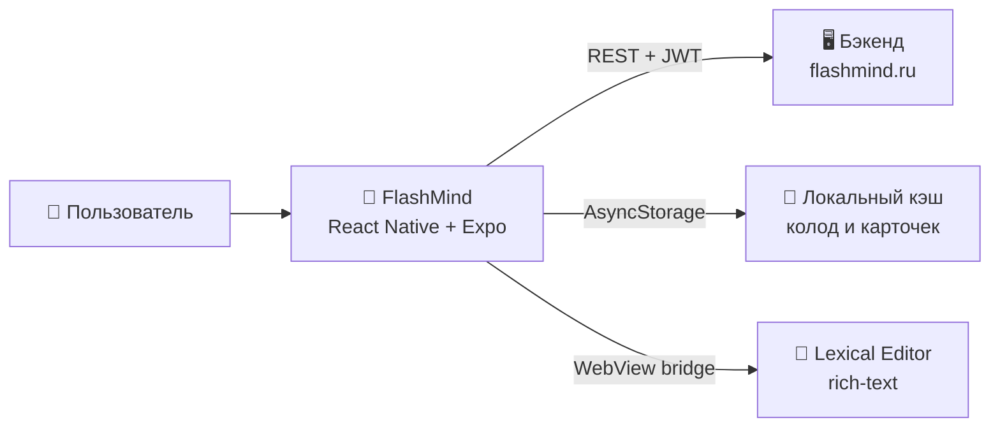

---
tags:
  - flashmind
  - moc
  - документация
created: 2026-08-26
project: FlashMind_Frontend
---

# 🏠 FlashMind — Documentation Hub

> [!abstract] Что это за хранилище
> Это **домашняя страница (MOC — Map of Content)** документации проекта **FlashMind** — кроссплатформенного приложения для интервального повторения флеш-карточек (iOS / Android / Web), написанного на **React Native + Expo Router**.
>
> Заметки связаны wiki-ссылками `[[]]` — открывайте их прямо в Obsidian. Каждая заметка самодостаточна, но ссылки помогают перемещаться по темам.

---

## 🗺️ Карта документации

### 🚀 Начало работы
- [[01 Обзор и архитектура]] — что такое FlashMind, стек технологий, схема слоёв приложения
- [[02 Быстрый старт]] — установка, переменные окружения, запуск на телефоне и в вебе
- [[03 Структура проекта]] — карта всех каталогов и файлов репозитория

### 🧭 Приложение
- [[04 Роутинг и экраны]] — все маршруты Expo Router, layouts, таб-бар, модалки
- [[05 API слой]] — axios-клиент, интерцепторы, refresh-токены, таблица эндпоинтов
- [[06 Состояние и кэш]] — Zustand-сторы и трёхуровневый кэш AsyncStorage
- [[07 Авторизация]] — вход, регистрация, восстановление пароля, онбординг

### 🃏 Функциональные модули
- [[08 Колоды и карточки]] — список колод, создание, просмотр, настройки
- [[09 Редактор карточек]] — Lexical-редактор в WebView, блоки карточки, шаблоны
- [[10 Режим изучения SRS]] — интервальное повторение, оценки карточек
- [[11 Статистика и AI]] — графики продуктивности и AI Insights
- [[12 Cloud Decks]] — публикация, импорт и синхронизация облачных колод

### 🎨 Инфраструктура
- [[13 UI-кит и стили]] — общие компоненты, Colors/Typography/Common, ассеты
- [[14 Safari-расширение и деплой]] — Xcode-расширение, Docker, nginx
- [[15 Конвенции разработки]] — правила кода, алиасы, линтеры, git-hooks

---

## 🧠 Проект в двух словах

> [!tip] С чего начать чтение
> Новичку: [[01 Обзор и архитектура]] → [[03 Структура проекта]] → [[02 Быстрый старт]].
> Разработчику фич: сразу [[05 API слой]] и [[06 Состояние и кэш]].

---

## 🔗 Связанные документы вне vault

- Полное руководство по rich-редактору: `docs/LexicalEditor.md` (850 строк, туториалы по кастомизации)
- README репозитория: `README.md`
