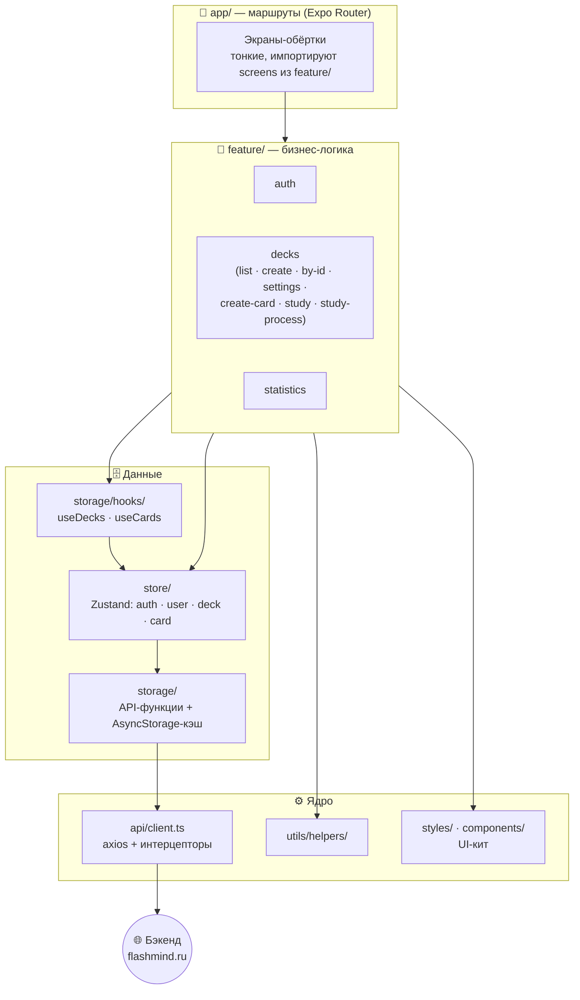

---
tags:
  - flashmind
  - архитектура
  - обзор
created: 2026-08-26
up: "[[00 Home]]"
---

# 🌟 01 — Обзор и архитектура

> [!abstract] О чём эта заметка
> Общее описание продукта, технологический стек и высокоуровневая архитектура. Читайте первой, чтобы понять «карту мира» перед погружением в код.

## 💡 Что такое FlashMind

**FlashMind** — приложение для обучения по методике **интервального повторения (SRS)**:

1. Пользователь создаёт **колоды** (`Deck`), внутри колод — **карточки** (`Card`) со сторонами *front* (вопрос/термин) и *back* (ответ/определение).
2. Приложение показывает карточки, пользователь оценивает, насколько легко вспомнил ответ.
3. Алгоритм на бэкенде (поля `difficulty` / `stability` у карточек указывают на FSRS-подобную модель) рассчитывает, когда показать карточку снова.

Платформы: **iOS**, **Android**, **Web** (PWA, домен `flashmind.ru`). Дополнительно в репозитории лежит **Safari Web Extension** ([[14 Safari-расширение и деплой]]).

---

## 🧰 Технологический стек

| Слой | Технология | Версия | Зачем |
| --- | --- | --- | --- |
| Ядро | React Native | 0.81.5 | кроссплатформенный UI |
| React | React / React DOM | 19.1.0 | компонентная модель |
| Сборка / рантайм | Expo SDK | 54 | тулчейн, нативные модули |
| Навигация | expo-router | ~6.0.21 | файловая навигация |
| Состояние | zustand | ^5.0.11 | глобальные сторы |
| Сеть | axios | ^1.13.4 | REST-клиент с интерцепторами |
| Токены | jwt-decode, expo-secure-store | — | JWT access-token, безопасное хранилище |
| Локальный кэш | @react-native-async-storage | 2.2.0 | кэш колод/карточек/профиля |
| Rich-text | lexical (+@lexical/react) | ^0.49.0 | редактор карточек |
| Мост RN↔WebView | @webview-bridge/react-native | ^1.4.0 | связь с Lexical в WebView |
| WebView | react-native-webview | 13.15.0 | контейнер редактора |
| Анимации | moti, react-native-reanimated | 4.1.1 | анимации интерфейса |
| Жесты | react-native-gesture-handler | 2.28.0 | свайпы, bottom-sheet |
| Bottom sheets | @gorhom/bottom-sheet | ^5.2.14 | модальные шторки |
| Графика | react-native-svg, masked-view, linear-gradient | — | иконки, градиенты |
| Toast | react-native-toast-message | ^2.3.3 | уведомления |
| Изображения | expo-image-picker, expo-image-manipulator, react-native-image-crop-picker, react-native-simple-image-cropper | — | выбор и обрезка картинок |
| Эмодзи | emoji-datasource-apple, react-apple-emojis | — | Apple-эмодзи как PNG |
| Типизация | TypeScript | ~5.9.2 | строгие типы |
| Качество | ESLint 9 (flat config) + Prettier + Husky + lint-staged | — | стиль кода |

> [!note] New Architecture
> В `app.json` включён флаг `newArchEnabled: true` — проект работает на новой архитектуре React Native (Fabric/TurboModules).

---

## 🏗️ Архитектура слоёв

Проект следует идеологии, близкой к **Feature-Sliced Design**: экраны собираются из файловых роутов, логика живёт в фичах, данные — в отдельных слоях.

### Правила зависимостей

- `app/*` (роуты) → импортируют экраны из `feature/*/screens` — сами роуты почти не содержат логики.
- `feature/*` → могут использовать `store/`, `storage/`, `components/`, `styles/`, `utils/`.
- `store/` → единственный владелец мутаций; ходит в сеть через `storage/api/api.ts`.
- `api/client.ts` → не знает о фичах; только транспорт, токены и обработка ошибок.

---

## 🔐 Модель данных и авторизации

- **Access token (JWT)** хранится **только в памяти** ([`useAuthStore`](../../store/auth.store.ts)) — при перезапуске приложения восстанавливается через refresh.
- **Refresh token** живёт в **httpOnly cookie** — запросы идут с `withCredentials: true`.
- При `401` интерцептор автоматически обновляет токен и повторяет запрос ([[05 API слой]]).
- Профиль пользователя кэшируется локально (`@profile`).

## 💾 Стратегия данных

- Колоды и карточки кэшируются в AsyncStorage с флагом актуальности `isActual` и меткой времени `expiresAt` (**до 4 утра следующего дня**) — подробнее в [[06 Состояние и кэш]].
- Мутации колод **оптимистичные**: UI обновляется мгновенно, при ошибке сервера происходит откат (rollback).

---

## 📦 Подприложения в репозитории

| Каталог | Что это |
| --- | --- |
| корень проекта | основное RN-приложение (Expo) |
| [`lexical-editor/`](../../lexical-editor/package.json) | отдельный Vite+React суб-апп: Lexical-редактор, собирается в один HTML и грузится в WebView ([[09 Редактор карточек]]) |
| [`FlashMind/`](../../FlashMind) | Xcode-проект Safari Web Extension (macOS/iOS, Manifest V3) ([[14 Safari-расширение и деплой]]) |

---

> [!summary] Итог
> FlashMind = Expo Router (навигация) + feature-модули (экраны) + Zustand (состояние) + AsyncStorage (кэш до 4 утра) + axios с авто-refresh (сеть) + Lexical в WebView (rich-text). Дальше: [[03 Структура проекта]].
