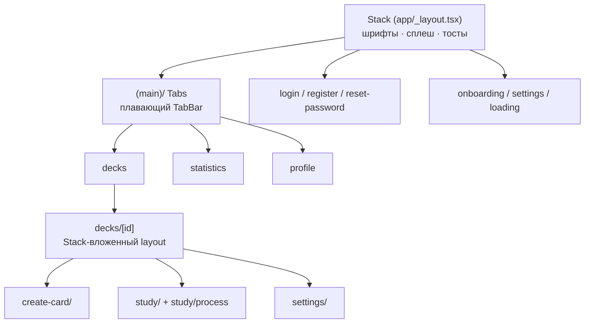
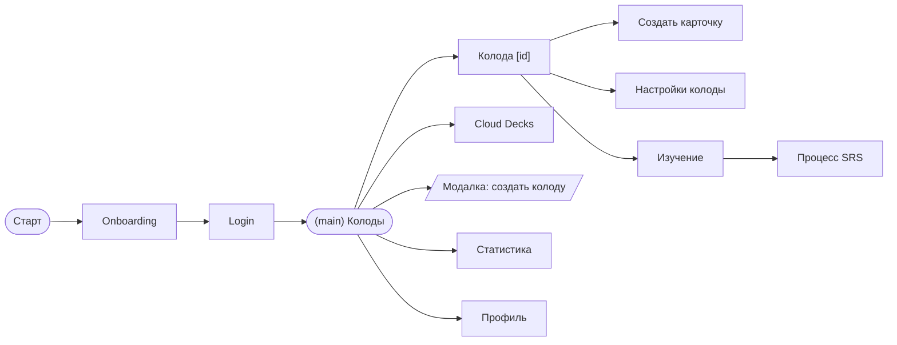

---
tags:
  - flashmind
  - навигация
  - expo-router
created: 2026-08-26
up: "[[00 Home]]"
---

# 🧭 04 — Роутинг и экраны

> [!abstract] О чём эта заметка
> Как устроена навигация на **Expo Router v6**: корневой Stack, группа табов `(main)`, динамические маршруты `[id]`/`[step]`, модальные презентации. Плюс полная таблица всех экранов приложения.

## 🏗️ Три уровня навигации

### Корневой layout — [`app/_layout.tsx`](../../app/_layout.tsx:91)

Что делает при старте:

1. `SplashScreen.preventAutoHideAsync()` — удерживает сплеш-скрин.
2. `useFonts` — загружает Montserrat (Regular/Medium/SemiBold/Bold) и CourierPrime; пока не загрузились — рендерит `null`.
3. После загрузки шрифтов скрывает сплеш и один раз (`fetchedRef`) вызывает `fetchUser()` из [`useUserStore`](../../store/userStore.ts:1), если нет access-token.
4. Рендерит `<Stack>` с настройками: без заголовков, анимация `slide_from_right`, жест возврата включён.
5. Экран `create-decks` переопределён как **модалка** (`presentation: "modal"`, `slide_from_bottom`).
6. Подключает кастомный конфиг тостов `react-native-toast-message`: зелёный success (#22C775) и красный error (#FA2C56) с поддержкой двух строк текста.
7. Всё обёрнуто в `GestureHandlerRootView`.

### Группа табов — [`app/(main)/_layout.tsx`](../../app/(main)/_layout.tsx:11)

Три таба **без подписей** (`tabBarShowLabel: false`), иконки — SVG-компоненты:

| Таб | Маршрут | Иконка |
| --- | --- | --- |
| Колоды | `(main)/decks/index` | [`CardsDeskIcon`](../../assets/icons/IconsTabBar/CardsDeskIcon.tsx) |
| Статистика | `(main)/statistics/index` | [`StatisticIcon`](../../assets/icons/IconsTabBar/StatisticIcon.tsx) |
| Профиль | `(main)/profile/index` | [`ProfileIcon`](../../assets/icons/IconsTabBar/ProfileIcon.tsx) |

TabBar «парит» над контентом: `position: absolute`, `bottom: 10`, ширина 95% (max 800), радиус 20, тень. Активная иконка — в цветном квадрате `colors.mainColor`, неактивная — на сером `#F1F1F1`.

---

## 📡 Полная таблица маршрутов

| URL | Файл | Экран / назначение |
| --- | --- | --- |
| `/` | `app/index/index.tsx` | входная точ (лончер/редирект) |
| `/home` | `app/home/index.tsx` | домашний экран |
| `/loading` | `app/loading/index.tsx` | экран загрузки |
| `/not-found` | `app/not-found/index.tsx` | 404 (сюда ведёт интерцептор при 404 от API) |
| `/decks` | `app/(main)/decks/index.tsx` | список колод → [[08 Колоды и карточки]] |
| `/statistics` | `app/(main)/statistics/index.tsx` | статистика → [[11 Статистика и AI]] |
| `/profile` | `app/(main)/profile/index.tsx` | профиль пользователя |
| `/create-decks` | `app/create-decks/index.tsx` | **модалка** создания колоды |
| `/decks/[id]` | `app/decks/[id]/index.tsx` | просмотр колоды, список карточек |
| `/decks/[id]/create-card` | `.../create-card/index.tsx` | конструктор карточек ([[09 Редактор карточек]]) |
| `/decks/[id]/create-card/create` | `create.tsx` | выбор шаблона/создание |
| `/decks/[id]/create-card/term-editor` | `term-editor.tsx` | редактор блока «Термин» |
| `/decks/[id]/create-card/text-editor` | `text-editor.tsx` | редактор блока «Текст» |
| `/decks/[id]/create-card/side-editor` | `side-editor.tsx` | редактор стороны карточки |
| `/decks/[id]/create-card/image-editor` | `image-editor.tsx` | редактор блока «Изображение» |
| `/decks/[id]/settings` | `settings/index.tsx` | настройки колоды |
| `/decks/[id]/study` | `study/index.tsx` | предпросмотр сессии ([[10 Режим изучения SRS]]) |
| `/decks/[id]/study/process` | `study/process/index.tsx` | процесс изучения |
| `/decks/cloud-decks` | `cloud-decks/index.tsx` | каталог облачных колод ([[12 Cloud Decks]]) |
| `/decks/cloud-decks/[cloudDeckId]` | `.../screens/CloudDecksPreview.tsx` | превью облачной колоды |
| `/decks/cloud-decks/card/[cloudCardId]` | `.../screens/CloudCardView.tsx` | карточка из облачной колоды |
| `/card/[cardId]` | `card/[cardId].tsx` | просмотр своей карточки |
| `/login` | `login/index.tsx` | вход ([[07 Авторизация]]) |
| `/register` → `/register/[step]` | `register/[step].tsx` | регистрация по шагам |
| `/reset-password` → `[step]` | `reset-password/[step].tsx` | восстановление пароля (4 шага) |
| `/onboarding` → `[step]` | `onboarding/[step].tsx` | приветственные экраны |
| `/settings` → `[step]` | `settings/[step].tsx` | настройки профиля по шагам |

> [!note] Динамические сегменты
> `[id]`, `[cardId]`, `[cloudDeckId]`, `[step]` — параметры маршрута. Внутри экрана читаются через хук `useLocalSearchParams` из expo-router.

---

## 🎬 Навигационные паттерны

- **Программная навигация** — импортируется `router` из `expo-router` (например, редирект на `/login` при неудачном refresh в [`auth.interceptor.ts`](../../api/interceptors/auth.interceptor.ts:82) или на `/not-found` при 404 в [`client.ts`](../../api/client.ts:28)).
- **Модалки** — через опции Stack.Screen (`presentation: "modal"`): так открыт `/create-decks`.
- **Вложенные layouts** — у `decks/[id]` есть собственный `_layout.tsx`, группирующий вложенные экраны колоды.
- **Жесты** — глобально включён свайп назад (`gestureEnabled: true`, направление horizontal).

## 🖼️ Карта переходов пользователя

---

> [!summary] Связанные заметки
> [[03 Структура проекта]] · [[07 Авторизация]] · [[08 Колоды и карточки]]
