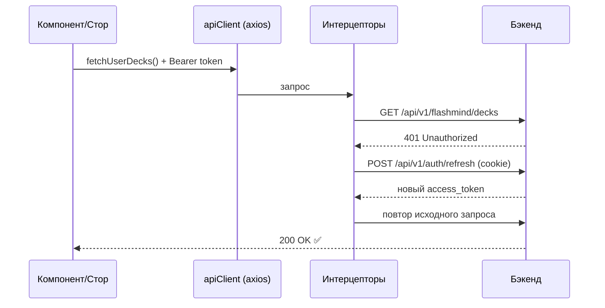

---
tags:
  - flashmind
  - api
  - axios
  - jwt
created: 2026-08-26
up: "[[00 Home]]"
---

# 🌐 05 — API слой

> [!abstract] О чём эта заметка
> Как приложение общается с бэкендом: единственный axios-клиент, три интерцептора (auth/error/timezone), механизм авто-refresh JWT, базовые URL из `.env` и полный справочник эндпоинтов.

## 🏛️ Общая схема



## ⚙️ Клиент — [`api/client.ts`](../../api/client.ts:1)

```ts
const apiClient = axios.create({
  baseURL: "",            // URL подставляется в каждом вызове через getMainServiceApiUrl()
  timeout: 15000,         // 15 секунд
  headers: { "Content-Type": "application/json" },
  withCredentials: true,  // ОБЯЗАТЕЛЬНО: httpOnly refresh-токен в cookie
});
```

Здесь же подключается **глобальная обработка ошибок ответа**:

| Условие | Реакция |
| --- | --- |
| `404` | `router.push("/not-found")` |
| `500` | тост «Ошибка сервера, попробуйте снова» |
| Network Error / `ERR_NETWORK` / нет ответа | тост «Проблема с сетью» |

> [!important] withCredentials
> Refresh-токен живёт в **httpOnly cookie**, поэтому каждый запрос к авторизации должен уходить с cookie. Забыть `withCredentials: true` = вечный 401.

## 🔗 Базовые URL — [`constants/api.ts`](../../constants/api.ts:1)

```ts
export const AUTH_BASE_URL = process.env.EXPO_PUBLIC_AUTH_API_URL;
export const MAIN_SERVICE_BASE_URL = process.env.EXPO_PUBLIC_MAIN_SERVICE_API_URL;
```

Хелперы [`getMainServiceApiUrl(path)`](../../api/getMainServiceApiUrl.ts:1) и [`getAuthApiUrl(path)`](../../feature/auth/api/getAuthApiUrl.ts:1) склеивают базу и путь. Значения задаются в `.env` ([[02 Быстрый старт]]).

---

## 🛡️ Интерцептор авторизации — [`auth.interceptor.ts`](../../api/interceptors/auth.interceptor.ts:31)

Ловит **401** и прозрачно обновляет токен:

1. Не 401 → пробросить ошибку дальше.
2. Это сам `/auth/refresh` → не зацикливаемся.
3. Нет заголовка `Authorization` или стоит флаг `_skipAuthRefresh` → проброс.
4. Если refresh уже идёт (`isRefreshing`) → запрос кладётся в `failedQueue` и ждёт.
5. Первый попавший 401 вызывает `refreshToken()`:
   - успех → все из очереди получают новый токен и повторяются; текущий запрос тоже повторяется с `Bearer <token>`;
   - провал → очередь отклоняется, `useAuthStore.logout()` + редирект на `/login`.

> [!tip] Очередь запросов
> Паттерн «single-flight refresh»: при одновременном 401 у пяти запросов на сервер уйдёт **один** refresh, остальные дождутся готового токена в очереди `failedQueue`.

Ручной вариант обновления — [`api/refresh.ts`](../../api/refresh.ts:8): POST `/api/v1/auth/refresh`, новый `access_token` сохраняется в стор.

## 🚨 Интерцептор ошибок — [`error.interceptor.ts`](../../api/interceptors/error.interceptor.ts:1)

Функция `handleApiError(err, humanMessage)` используется во всех API-функциях проекта: логирует детали, показывает понятный тост пользователю и пробрасывает ошибку выше для обработки вызывающим кодом.

## 🕐 Timezone-интерцептор — [`timezone.interceptor.ts`](../../api/interceptors/timezone.interceptor.ts:1)

Добавляет часовой пояс устройства в запросы — бэкенд использует его для расчёта расписания повторений («до 4 утра» и статистика по дням).

---

## 📚 Справочник эндпоинтов

### Авторизация (AUTH_BASE_URL) — [[07 Авторизация]]

| Метод | Путь | Назначение |
| --- | --- | --- |
| POST | `/api/v1/auth/login` | вход, выдаёт access_token + cookie |
| POST | `/api/v1/auth/register` | регистрация |
| POST | `/api/v1/auth/refresh` | обновление access_token (по cookie) |

### Колоды ([`storage/api/api.ts`](../../storage/api/api.ts:54))

| Метод | Путь | Функция | Ответ/Payload |
| --- | --- | --- | --- |
| GET | `/api/v1/flashmind/decks` | `fetchUserDecks()` | `DecksResponse { decks: Deck[] }` |
| POST | `/api/v1/flashmind/decks` | `createNewDeck({name, description, color})` | `Deck` |
| PUT | `/api/v1/flashmind/decks/{deckId}` | `updateDeck(id, payload)` | payload: name, description, desired_retention, maximum_interval, color |
| DELETE | `/api/v1/flashmind/decks/{deckId}` | `deleteDeckOnServer(id)` | — |

### Карточки

| Метод | Путь | Функция | Особенность |
| --- | --- | --- | --- |
| GET | `/api/v1/flashmind/cards?deck_id=&page=&per_page=` | `fetchCards()` | карточки **без поля back** (экономия трафика) |
| GET | `/api/v1/flashmind/cards/{cardId}` | `fetchCardById()` | полная карточка с back |
| POST | `/api/v1/flashmind/cards` | создание карточки | `{deck_id, front, back}` |
| PUT | `/api/v1/flashmind/cards/{cardId}` | обновление карточки | `{front, back}` |

### Изучение ([[10 Режим изучения SRS]])

| Метод | Путь | Функция | Тело/Параметры |
| --- | --- | --- | --- |
| GET | `/api/v1/flashmind/study?deck_id=` | `getStudyInfo(deckId)` | счётчики: in_learning, learned, learning_today, total |
| POST | `/api/v1/flashmind/study` | `getStudyCard(deckId, total)` | получить пачку карточек для сессии |
| PATCH | `/api/v1/flashmind/study` | `postCardRating(cardId, rating, reviewDuration)` | оценка карточки; 200 → повтор, 204 → изучено |

### Статистика ([[11 Статистика и AI]])

| Метод | Путь | Функция | Ответ |
| --- | --- | --- | --- |
| GET | `/api/v1/flashmind/stats/stats?deck_id=` | `fetchStats(deckId?)` | `StatsResponse`: forecast, review_count, review_time, hourly_breakdown, difficulty/stability distribution, card_types |

### Cloud Decks ([[12 Cloud Decks]])

| Операция | Где код | Суть |
| --- | --- | --- |
| Публикация колоды | `storage/api/api.ts` | `CloudDeckShareResponse { cloud_uuid, sync_stats{added,deleted,updated} }` |
| Импорт облачной колоды | там же | `CloudDeckImportResponse { deck_id, cards[], cloud_uuid }` |
| Каталог/превью | `app/decks/cloud-decks/**` | публичные/приватные колоды |

---

## 🧾 Ключевые типы — [`storage/types/types.ts`](../../storage/types/types.ts:1)

```ts
interface Deck {
  id: string;
  name: string;
  description: string;
  total_cards: number;
  repeat_cards: number;
  settings: DeckSettings;      // color, desired_retention, maximum_interval
  cloud_info: CloudInfo;       // is_cloud_deck, needs_sync, PUBLIC/PRIVATE…
}

interface Card {
  id: string;
  front: string;               // HTML из Lexical
  back?: string;               // HTML (в списках отсутствует!)
  deck_id: string;
  difficulty?: number;         // параметры SRS-модели
  stability?: number;
}
```

> [!warning] Uрезанные карточки в списках
> Списочные эндпоинты возвращают карточки без `back`. Полная карточка грузится отдельно по её id — так сделано в экране просмотра карточки `/card/[cardId]`.

## 🔍 Отладка сети

Проект обильно логирует сетевые события с эмодзи-префиксами: `🌐 запрос`, `✅ успех`, `❌ ошибка`. Фильтруйте консоль по `[Storage]`, `getDecks`, `API:` ([[15 Конвенции разработки]]).

---

> [!summary] Связанные заметки
> [[06 Состояние и кэш]] · [[07 Авторизация]] · [[10 Режим изучения SRS]]
