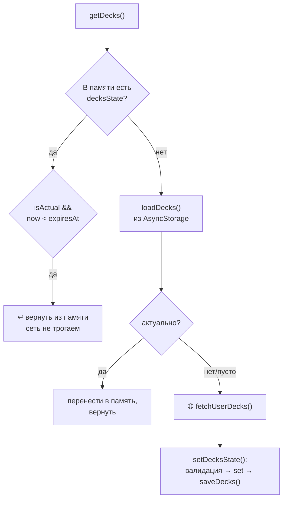

---
tags:
  - flashmind
  - zustand
  - asyncstorage
  - кэш
created: 2026-08-26
up: "[[00 Home]]"
---

# 🗄️ 06 — Состояние и кэш

> [!abstract] О чём эта заметка
> Управление состоянием на **Zustand** (4 глобальных стора + фиче-сторы) и собственная система кэширования в **AsyncStorage** с флагом актуальности и сбросом «в 4 утра».

## 🧱 Глобальные сторы (`store/`)

| Стор | Файл | Ответственность |
| --- | --- | --- |
| `useAuthStore` | [`auth.store.ts`](../../store/auth.store.ts:1) | `accessToken`, `isAuthenticated`, `setAccessToken()`, `logout()` |
| `useUserStore` | [`userStore.ts`](../../store/userStore.ts:1) | профиль пользователя, `fetchUser()` (вызывается из корневого layout) |
| `useDeckStore` | [`deck.store.ts`](../../store/deck.store.ts:1) | колоды: загрузка, кэш, оптимистичные мутации |
| `useCardStore` | [`card.store.ts`](../../store/card.store.ts:1) | карточки текущей колоды (`StoreCard`) |

Фиче-сторы авторизации: [`feature/auth/store/register.store.ts`](../../feature/auth/store/register.store.ts:1) и [`resetPassword.store.ts`](../../feature/auth/store/resetPassword.store.ts:1) — данные многошаговых форм ([[07 Авторизация]]).

> [!note] Почему токен только в памяти
> `useAuthStore` не персистится намеренно: access-token живёт до перезапуска приложения, а при старте восстанавливается через refresh-cookie. Это безопаснее, чем хранить JWT на диске.

---

## 🃏 useDeckStore — сердце данных колод

Крупнейший стор проекта (~480 строк). Три сценария в `getDecks()`:



### Контракт состояния кэша

```ts
interface DecksStorageState {
  isActual: boolean;   // флаг актуальности (инвалидация)
  expiresAt: number;   // timestamp «4 утра следующего дня»
  decks: Deck[];
}
```

- **Единая точка записи** — `setDecksState()`: сначала жёсткая валидация формата (`validateFormat` бросает ошибку при нарушении структуры), затем `set()` в память и `saveDecks()` на диск.
- **Инвалидация** — `invalidateDecks()` ставит `isActual: false` (в памяти и на диске); следующий `getDecks()` пойдёт в сеть.
- **Оптимистичные мутации с rollback**: `createNewDeck`, `updateDeck`, `deleteDeck` сразу меняют локальное состояние; при ошибке сервера состояние откатывается.
- **Счётчики для UI**: `updateDeckTotalCards(deckId, "increment"|"decrement")`, `updateDeckReviewCount(deckId, n|"decrement")`.
- **Синхронизация облака**: `markDeckNeedsSync(deckId)` / `markDeckSynced(deckId)` — точечно выставляют `cloud_info.needs_sync` ([[12 Cloud Decks]]).

---

## 💾 AsyncStorage-слой — `storage/service/`

### Ключи

| Ключ | Что лежит |
| --- | --- |
| `@flashcards/decks` | `DecksStorageState` — все колоды + метаданные кэша |
| `@flashcards/deck_cards_{deckId}` | `{ isActual, cards }` — карточки конкретной колоды |
| `@profile` | кэш профиля пользователя |

### Функции [`decksStorage.ts`](../../storage/service/decksStorage.ts:27)

| Функция | Назначение |
| --- | --- |
| `saveDecks(state)` | запись с предварительной валидацией структуры |
| `loadDecks()` | чтение; **старый/битый формат автоматически удаляется**, возвращается `null` → стор пойдёт в сеть |
| `updateSingleDeckInStorage(id, fields)` | точечный merge полей одной колоды |
| `saveDeckCards(deckId, data)` / `loadDeckCards(deckId)` | карточки колоды с флагом актуальности |
| `updateCardInDeck(deckId, cardId, updates)` | обновление одной карточки на диске |
| `clearAllData()` | полная очистка ключей `@flashcards/*` и `@profile` (для отладки) |

> [!important] Мягкая миграция формата
> Если на диске обнаружены данные старого формата (например, просто массив без `expiresAt`), они **не роняют приложение**, а удаляются с логом «⚠️ Сбрасываем кэш». Это позволяет менять формат хранения без миграций.

### «4 утра» — [`calculateExpiryTime`](../../utils/helpers/calculateExpiryTime.ts)

`expiresAt` = ближайшие 04:00 следующего дня по локальному времени. Логика: кэш живёт минимум до первой ночной синхронизации расписания повторений.

---

## 🪝 Хуки-фасады — `storage/hooks/`

- [`useDecks.ts`](../../storage/hooks/useDecks.ts:1) — обёртка над `useDeckStore`: подписка на `decksState`, вызов `getDecks()` при монтировании.
- [`useCards.ts`](../../storage/hooks/useCards.ts:1) — аналогично для карточек выбранной колоды (память → диск → сеть).

Экраны работают **только через хуки и сторы**, напрямую сетевые функции почти нигде не вызываются.

## 👤 Профиль — [`profileStorage.ts`](../../storage/service/profileStorage.ts:1)

Кэширует данные пользователя под ключом `@profile`, чтобы `/profile` открывался мгновенно и работал офлайн.

---

## 🔎 Отладка кэша

Все операции логируются:

```
💾 [Storage] Список колод сохранен на диск. Количество: 5 шт. Флаг: true
📦 getDecks: Данные актуальны в памяти, сеть не трогаем
🚨 invalidateDecks: Меняем флаг на false на диске и в памяти
⚠️ [Storage] На диске обнаружен старый формат колод...
```

Полный сброс локальных данных: вызвать `clearAllData()` или очистить данные приложения.

---

> [!summary] Связанные заметки
> [[05 API слой]] · [[08 Колоды и карточки]] · [[15 Конвенции разработки]]
