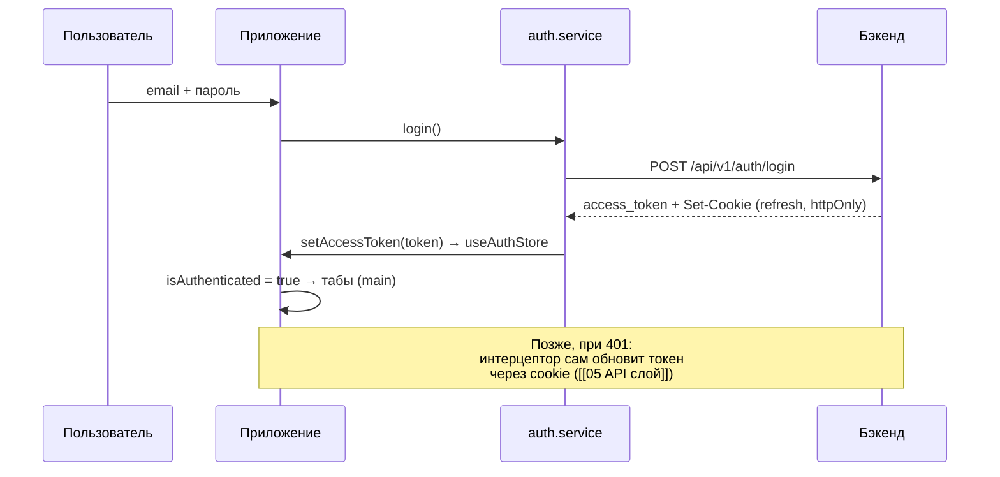
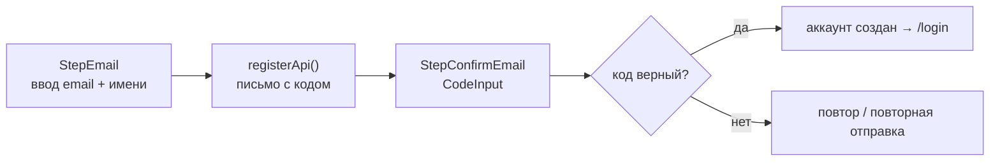

---
tags:
  - flashmind
  - auth
  - jwt
created: 2026-08-26
up: "[[00 Home]]"
---

# 🔐 07 — Авторизация

> [!abstract] О чём эта заметка
> Модуль `feature/auth`: вход, многошаговая регистрация, восстановление пароля, онбординг. Как устроен JWT-флоу (access в памяти + refresh в httpOnly cookie), валидаторы и сторы шагов.

## 🔄 Общий флоу

**Ключевое правило:** access-token хранится **только в памяти** ([`useAuthStore`](../../store/auth.store.ts:1)); refresh-токен сервер кладёт в httpOnly cookie, все запросы идут с `withCredentials: true`. При неудачном refresh интерцептор делает `logout()` и редирект на `/login`.

---

## 🚪 Вход — `feature/auth/login/`

| Файл | Роль |
| --- | --- |
| [`screens/login.tsx`](../../feature/auth/login/screens/login.tsx) | форма входа, показ/скрытие пароля (иконки open/close eyes) |
| [`api/login.api.ts`](../../feature/auth/login/api/login.api.ts) | запрос к `/auth/login` через AUTH_BASE_URL |
| [`types/api.types.ts`](../../feature/auth/login/types/api.types.ts) | `LoginResponse { access_token, ... }` |
| [`styles/login.styles.ts`](../../feature/auth/login/styles/login.styles.ts) | стили экрана |

## 📝 Регистрация — `feature/auth/register/`

Двухшаговый процесс, маршрут `/register/[step]`:

- [`components/CodeInput.tsx`](../../feature/auth/components/CodeInput.tsx) — поле ввода кода подтверждения по символам.
- [`hooks/useInterval.ts`](../../feature/auth/hooks/useInterval.ts) — таймер повторной отправки кода.
- Стор шагов: [`store/register.store.ts`](../../feature/auth/store/register.store.ts) — email, имя, состояние между экранами.
- Валидаторы: [`email.validator.ts`](../../feature/auth/validators/email.validator.ts), [`user-name.validator.ts`](../../feature/auth/validators/user-name.validator.ts).

## 🔑 Восстановление пароля — `feature/auth/reset-password/`

Маршрут `/reset-password/[step]`, четыре шага:

| Шаг | Экран | Что происходит |
| --- | --- | --- |
| 1 | [`FirstStep.tsx`](../../feature/auth/reset-password/screens/FirstStep.tsx) | ввод email |
| 2 | [`SecondStep.tsx`](../../feature/auth/reset-password/screens/SecondStep.tsx) | ввод кода из письма |
| 3 | [`ThirdStep.tsx`](../../feature/auth/reset-password/screens/ThirdStep.tsx) | новый пароль |
| 4 | [`LastStep.tsx`](../../feature/auth/reset-password/screens/LastStep.tsx) | успех → на логин |

API: [`resetPassword.api.ts`](../../feature/auth/reset-password/api/resetPassword.api.ts); состояние между шагами: [`resetPassword.store.ts`](../../feature/auth/store/resetPassword.store.ts); типы: [`types.api.ts`](../../feature/auth/reset-password/types/types.api.ts).

## 👋 Онбординг

`app/onboarding/[step].tsx` — приветственные слайды для новых пользователей. Показывается до авторизации; после завершения пользователь попадает на логин.

---

## 🧩 Сопутствующие элементы

- **Токены**: чтение id пользователя из JWT — хелпер [`getUserIdFromToken`](../../utils/helpers/getUserIdFromToken.ts) (использует `jwt-decode`).
- **Безопасное хранилище**: плагин `expo-secure-store` подключён в `app.json` — доступен для чувствительных данных.
- **Ошибки API**: все сообщения нормализует `handleApiError` и показывает тост ([[05 API слой]]).

> [!warning] Частые грабли
> - Забытый `withCredentials: true` → refresh всегда падает («отсутствует куки» в логах).
> - Изменённый `.env` без перезапуска Metro → старые URL.
> - 401 на запросах без `Authorization` не триггерит refresh (так задумано) — убедитесь, что токен добавлен в заголовок.

---

> [!summary] Связанные заметки
> [[05 API слой]] · [[04 Роутинг и экраны]] · [[06 Состояние и кэш]]
