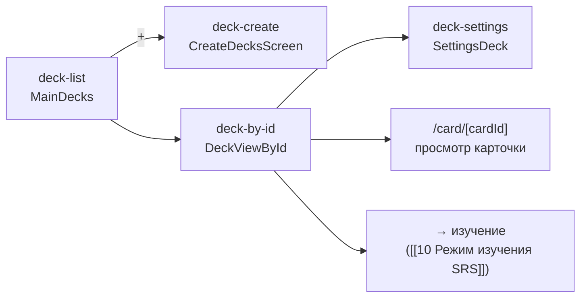
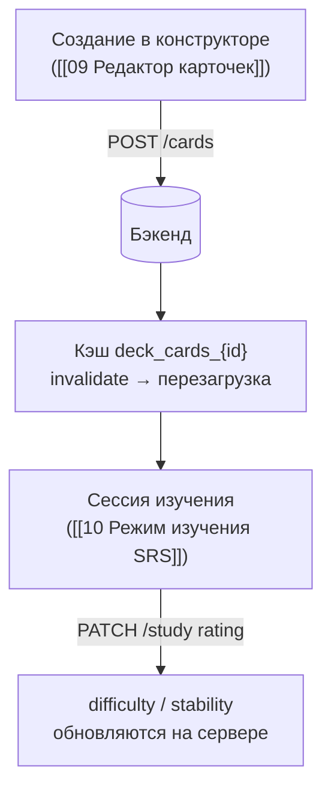

---
tags:
  - flashmind
  - decks
  - cards
created: 2026-08-26
up: "[[00 Home]]"
---

# 🃏 08 — Колоды и карточки

> [!abstract] О чём эта заметка
> Основной контур приложения: список колод, создание колоды, просмотр колоды с карточками, настройки колоды и просмотр отдельной карточки.

## 🗂️ Подмодули `feature/decks/`

## 📚 Список колод — `deck-list/`

Экран [`MainDecks.tsx`](../../feature/decks/deck-list/screens/MainDecks.tsx) (маршрут `/decks`, первый таб):

- Данные получает через хук [`useDecks`](../../storage/hooks/useDecks.ts) → `useDeckStore.getDecks()` ([[06 Состояние и кэш]]): память → диск → сеть.
- Отрисовка элементов — компонент [`DecksView.tsx`](../../feature/decks/deck-list/components/DecksView.tsx): цветной превью-блок (цвет колоды), название, описание, счётчики карточек.
- Кнопка «+» открывает модалку создания; есть переход в каталог облачных колод ([[12 Cloud Decks]]).
- Форматирование чисел — хелперы [`formatNumber`](../../utils/helpers/formatNumber.ts), [`getPluralCards`](../../utils/helpers/getPluralCards.ts).

## ➕ Создание колоды — `deck-create/`

Экран [`CreateDecksScreen.tsx`](../../feature/decks/deck-create/screens/CreateDecksScreen.tsx), маршрут `/create-decks` (**модалка** поверх Stack):

1. Пользователь вводит название, описание и выбирает цвет через [`colorPalette.tsx`](../../feature/decks/components/colorPalette.tsx).
2. Вызов `useDeckStore.createNewDeck(title, { description, color })`.
3. Стор отправляет `POST /api/v1/flashmind/decks` и **оптимистично** добавляет колоду в список (при ошибке — rollback).

## 🔍 Колода по id — `deck-by-id/`

Экран [`DeckViewById.tsx`](../../feature/decks/deck-by-id/screens/DeckViewById.tsx), маршрут `/decks/[id]`:

- Загружает метаданные колоды из стора и урезанный список карточек (`fetchDeckCards` — без поля back, [[05 API слой]]).
- Элемент списка — [`CardItem.tsx`](../../feature/decks/deck-by-id/components/CardItem.tsx): front карточки рендерится как HTML через [`HtmlText`](../../feature/decks/deck-create-card/components/HtmlText.tsx) (`react-native-render-html`).
- Кнопка «изучать» ведёт на `/decks/[id]/study`; кнопка «+» — в конструктор карточек ([[09 Редактор карточек]]).

### Модальные сценарии

| Компонент | Назначение |
| --- | --- |
| [`ShareDeckModal.tsx`](../../feature/decks/deck-by-id/components/ShareDeckModal.tsx) | публикация колоды в облако, получение ссылки/cloud_uuid ([[12 Cloud Decks]]) |
| [`BecomeAuthorModal.tsx`](../../feature/decks/deck-by-id/components/BecomeAuthorModal.tsx) | импортированная облачная колода → стать её автором |
| [`ShareDeckDeleteCloudModal.tsx`](../../feature/decks/deck-by-id/components/ShareDeckDeleteCloudModal.tsx) | снятие колоды с публикации |
| [`CustomAlertCloud.tsx`](../../feature/decks/deck-by-id/components/CustomAlertCloud.tsx) | алерты про облачные операции |

## ⚙️ Настройки колоды — `deck-settings/`

Экран [`SettingsDeck.tsx`](../../feature/decks/deck-settings/screens/SettingsDeck.tsx), маршрут `/decks/[id]/settings`:

| Настройка | Поле | Смысл |
| --- | --- | --- |
| Цвет | `settings.color` | оформление плитки колоды |
| Желаемое удержание | `settings.desired_retention` | целевой % запоминания для SRS-алгоритма |
| Максимальный интервал | `settings.maximum_interval` | потолок дней между повторениями |

Сохранение — `updateDeck(id, payload)` → `PUT /api/v1/flashmind/decks/{id}`, локально мержится через `updateSingleDeckInStorage`.

## 🎴 Просмотр карточки

Маршрут `/card/[cardId]`: полная карточка грузится через `fetchCardById` (с полем back), стороны front/back рендерятся как HTML. Отсюда же доступны редактирование и удаление карточки.

---

## 🧮 Жизненный цикл данных карточки

> [!tip] Инвалидация после мутаций
> После создания/удаления карточки стор вызывает `updateDeckTotalCards()` и инвалидацию кэша карточек, чтобы списки пересчитались без ручного refresh.

---

> [!summary] Связанные заметки
> [[09 Редактор карточек]] · [[10 Режим изучения SRS]] · [[12 Cloud Decks]]
