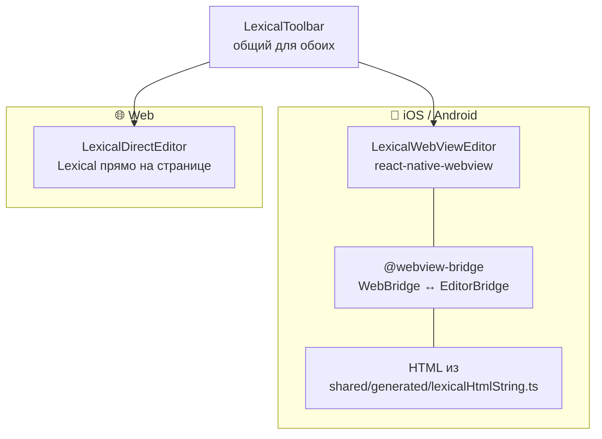

---
tags:
  - flashmind
  - lexical
  - webview
  - editor
created: 2026-08-26
up: "[[00 Home]]"
---

# 📝 09 — Редактор карточек (Lexical)

> [!abstract] О чём эта заметка
> Как устроен rich-text-редактор сторон карточки: блоки «Термин / Текст / Изображение», шаблоны, два режима работы Lexical (WebView-мост на мобильных и прямой в вебе), тулбар и команды. **Полное руководство с туториалами — в `docs/LexicalEditor.md`**, здесь — архитектурная выжимка.

## 🧱 Модель карточки: блоки

Карточка = набор блоков (типы в [`deck-create-card/types/cardBlocks.ts`](../../feature/decks/deck-create-card/types/cardBlocks.ts)):

| Блок | Компонент | Содержимое |
| --- | --- | --- |
| Термин | [`TermBlock.tsx`](../../feature/decks/deck-create-card/components/blocks/TermBlock.tsx) | HTML из Lexical (жирный, списки, цвет…) |
| Текст | [`TextBlock.tsx`](../../feature/decks/deck-create-card/components/blocks/TextBlock.tsx) | произвольный HTML |
| Изображение | [`ImageBlock.tsx`](../../feature/decks/deck-create-card/components/blocks/ImageBlock.tsx) | картинка (выбор/обрезка) |

Шаблоны сторон описаны в [`editorTemplate.ts`](../../feature/decks/deck-create-card/components/editorTemplate.ts); выбор шаблона — экран `TemplateSelectScreen.tsx` (`/decks/[id]/create-card/create`).

## 🌉 Два режима редактора



| Файл | Платформа | Механизм |
| --- | --- | --- |
| [`LexicalWebViewEditor.tsx`](../../feature/decks/deck-create-card/components/LexicalWebViewEditor.tsx) | мобилки | WebView + `@webview-bridge`; страница редактора собрана Vite и вшита как строка HTML |
| [`LexicalDirectEditor.tsx`](../../feature/decks/deck-create-card/components/LexicalDirectEditor.tsx) | web | тот же Lexical (^0.49) напрямую в DOM |
| [`LexicalToolbar.tsx`](../../feature/decks/deck-create-card/components/LexicalToolbar.tsx) + [`lexical/toolbarActions.ts`](../../feature/decks/deck-create-card/components/lexical/toolbarActions.ts) | все | кнопки: bold/italic/underline/strikethrough/code, h1–h3, списки, выравнивание, цвет текста, undo/redo |

Контракт моста типизирован в [`shared/types.ts`](../../shared/types.ts:1):

- `WebBridge` — методы RN → WebView: `formatTextCommand`, `setHeadingCommand`, `toggleBulletListCommand`, `setColorCommand`, `getEditorHtml`, `setEditorHtml`…
- `EditorBridgeState` — WebView → RN: `isReady`, `toolbarState` (какие кнопки активны), `hasFocus`, `changeNotification({ htmlText, plainText })`.

> [!important] Две версии Lexical
> Приложение использует `lexical@^0.49`, суб-апп `lexical-editor/` — свою версию. Поэтому `shared/types.ts` объявляет команды локальными union-типами, совместимыми с обеими версиями, и не импортирует типы из `lexical`.

## 🖼️ Экраны конструктора

Маршруты внутри `/decks/[id]/create-card/`:

| Экран | Назначение |
| --- | --- |
| `index.tsx` + `CreateCard.tsx` | сборка карточки из блоков, bottom-sheet добавления блока ([AddBlockBottomSheet](../../feature/decks/deck-create-card/components/AddBlockBottomSheet.tsx)) |
| `term-editor.tsx` / `text-editor.tsx` | полноэкранный ввод для блока Term/Text |
| `side-editor.tsx` ([SideEditor.tsx](../../feature/decks/deck-create-card/screens/SideEditor.tsx)) | редактирование одной стороны карточки |
| `image-editor.tsx` ([ImageEditor.tsx](../../feature/decks/deck-create-card/components/editors/ImageEditor.tsx)) | выбор фото (`expo-image-picker`) и обрезка ([ImageCropModal](../../feature/decks/deck-create-card/components/ImageCropModal.tsx)) |
| `PreviewModal.tsx` | предпросмотр готовой карточки |

Сохранение: HTML каждого блока собирается в `front`/`back` → `POST/PUT /api/v1/flashmind/cards` ([[05 API слой]]).

## 🔨 Суб-приложение `lexical-editor/`

Отдельный Vite+React проект:

```
lexical-editor/
├── src/
│   ├── Editor.tsx              # корневой LexicalComposer + плагины
│   ├── EditorTheme.ts          # CSS-классы узлов Lexical
│   ├── plugins/
│   │   └── EditorBridgePlugin.tsx  # регистрация WebBridge, sync toolbarState
│   └── utils/getSelectedNode.ts
├── vite.config.ts              # build → один инлайн-HTML
└── package.json                # своя версия lexical
```

**Пайплайн изменений:** правки в `lexical-editor/src` → `npm run build` внутри суб-аппа → обновить [`shared/generated/lexicalHtmlString.ts`](../../shared/generated/lexicalHtmlString.ts) → пересборка основного приложения. Без этого шага мобильный редактор продолжит работать со старой версией.

Тема редактора RN-стороны: [`lexical/EditorTheme.ts`](../../feature/decks/deck-create-card/components/lexical/EditorTheme.ts); получение текущего узла: [`getSelectedNode.ts`](../../feature/decks/deck-create-card/components/lexical/getSelectedNode.ts).

---

> [!example] Быстрые ответы
> **Как добавить кнопку в тулбар?** 1) команда в `shared/types.ts` (WebBridge) и в суб-аппе; 2) реализация в `EditorBridgePlugin`; 3) кнопка + действие в `LexicalToolbar`/`toolbarActions`. Подробный туториал (включая таблицы) — `docs/LexicalEditor.md`.
>
> **Почему на вебе всё работает без WebView?** `LexicalDirectEditor` монтирует Lexical в обычный DOM браузера; мост не нужен, API компонентов совпадает.

> [!summary] Связанные заметки
> [[08 Колоды и карточки]] · [[05 API слой]] · [[15 Конвенции разработки]]
