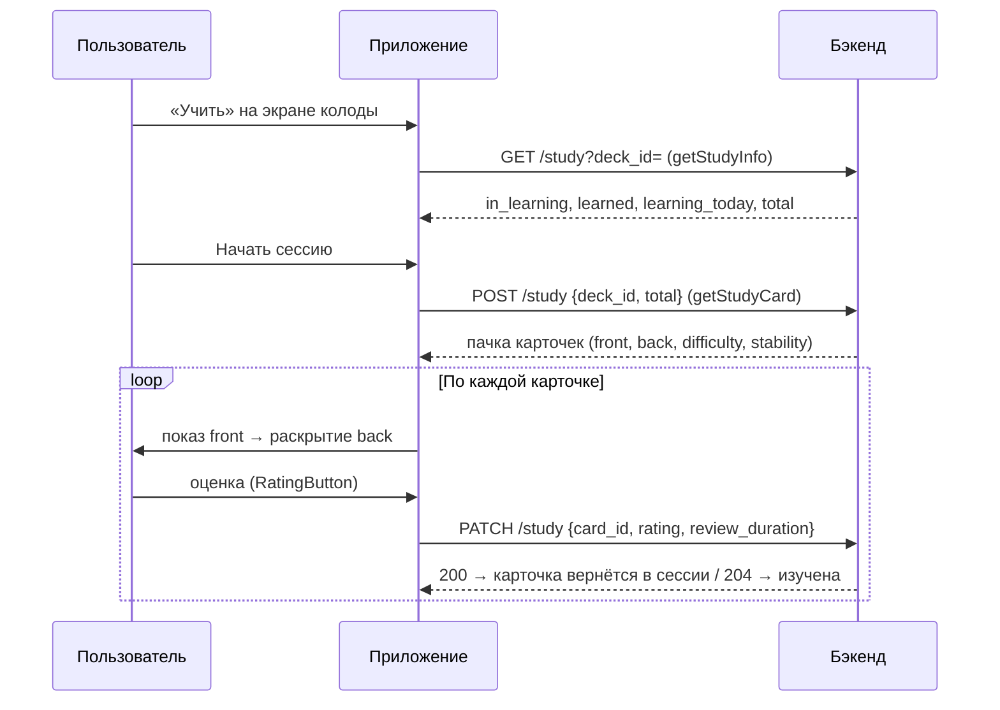

---
tags:
  - flashmind
  - srs
  - study
created: 2026-08-26
up: "[[00 Home]]"
---

# 🧠 10 — Режим изучения (SRS)

> [!abstract] О чём эта заметка
> Как работает сессия интервального повторения: предпросмотр (`deck-study`), сам процесс (`deck-study-process`), оценки карточек и связь с SRS-параметрами колоды.

## 🔄 Цикл сессии



## 📊 Предпросмотр — `deck-study/`

Экран [`StudyDecksScreen.tsx`](../../feature/decks/deck-study/screens/StudyDecksScreen.tsx), маршрут `/decks/[id]/study`:

- Запрос [`getStudyInfo(deckId)`](../../feature/decks/deck-study/api/api.ts:22) → `GET /api/v1/flashmind/study?deck_id=`.
- Ответ `StudyResponse`:

```ts
{
  cards: StudyCard[];      // превью очереди
  in_learning: number;     // карточек в процессе
  learned: number;         // выучено
  learning_today: number;  // запланировано на сегодня
  total: number;           // всего в колоде
}
```

- Инфо-блоки — компонент [`InfoStudy.tsx`](../../feature/decks/components/InfoStudy.tsx); иконки +/- в `deck-study/assets/icon/`.

## ⚔️ Процесс — `deck-study-process/`

Экран [`StudyDecksScreen.tsx`](../../feature/decks/deck-study-process/screens/StudyDecksScreen.tsx) (маршрут `/decks/[id]/study/process`):

| Элемент | Файл | Роль |
| --- | --- | --- |
| Показ карточки | [`StudyCardView.tsx`](../../feature/decks/deck-study-process/components/StudyCardView.tsx) | front как HTML → тап → back; рендер HTML через `HtmlText` |
| Кнопки оценки | [`RatingButton.tsx`](../../feature/decks/deck-study-process/components/RatingButton.tsx) | отправка рейтинга |
| API | [`api/api.ts`](../../feature/decks/deck-study-process/api/api.ts) | `getStudyCard()` и `postCardRating()` |

### Оценка карточки

[`postCardRating(cardId, rating, reviewDuration)`](../../feature/decks/deck-study-process/api/api.ts:47) → `PATCH /api/v1/flashmind/study`:

```ts
{ card_id: string, rating: number, review_duration: number }
```

- **200** — сервер вернул обновлённую карточку: она ещё появится в этой сессии (повтор).
- **204** — карточка полностью изучена, из очереди уходит.
- `review_duration` — сколько секунд пользователь смотрел карточку (используется в статистике «время ответа», [[11 Статистика и AI]]).

## 🎛️ Связь с настройками колоды

SRS-алгоритм на бэкенде учитывает параметры из [[08 Колоды и карточки]]:

- `desired_retention` — целевой процент удержания;
- `maximum_interval` — максимальный интервал между повторениями.

Поля карточек `difficulty` и `stability` приходят с сервера и отражают состояние модели памяти (FSRS-подобной): чем выше stability, тем позже следующее повторение.

## 🕰️ Расписание и «4 утра»

Сервер планирует очередь повторений на календарные дни; timezone-интерцептор передаёт пояс устройства ([[05 API слой]]), а локальный кэш колод сбрасывается каждый день в 04:00 ([[06 Состояние и кэш]]) — так «сегодняшняя» очередь всегда синхронна с сервером.

---

> [!summary] Связанные заметки
> [[08 Колоды и карточки]] · [[11 Статистика и AI]] · [[05 API слой]]
