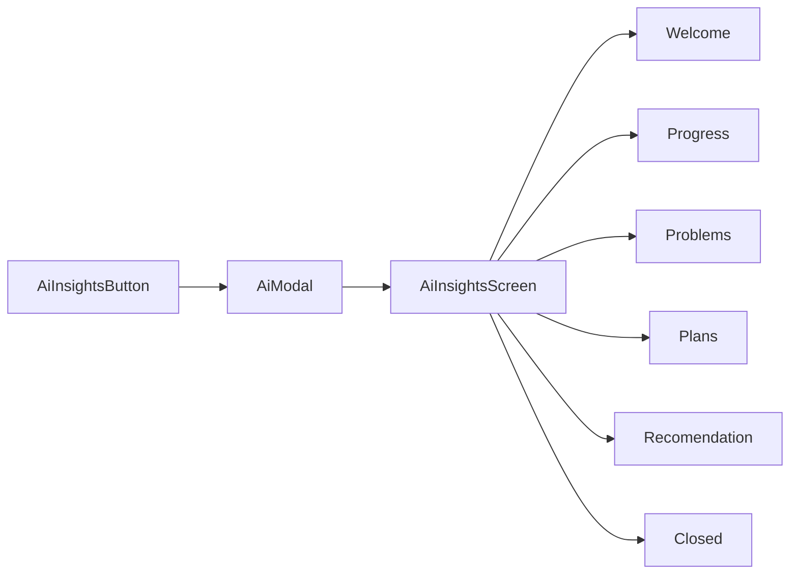

---
tags:
  - flashmind
  - statistics
  - ai
created: 2026-08-26
up: "[[00 Home]]"
---

# 📊 11 — Статистика и AI Insights

> [!abstract] О чём эта заметка
> Экран статистики: метрики, четыре графика, фильтр по колоде и модуль AI-инсайтов (аналитика обучения от LLM).

## 🖥️ Экран

[`statisticsScreen.tsx`](../../feature/statistics/screens/statisticsScreen.tsx), маршрут `/statistics` (второй таб). Данные — [`fetchStats(deckId?)`](../../feature/statistics/api/statsApi.ts:68) → `GET /api/v1/flashmind/stats/stats?deck_id=`.

### Структура ответа `StatsResponse`

| Поле | Содержимое | Где отображается |
| --- | --- | --- |
| `one_time_metrics` | `total_reviews`, `total_study_seconds` | карточки-метрики сверху |
| `forecast.points` | `{date, count}` — прогноз нагрузки | график будущих повторений |
| `review_count.points` | `{date, forgotten, hard, good, easy}` | продуктивность по дням |
| `review_time.points` | `{date, seconds}` | время занятий |
| `hourly_breakdown.points` | `{hour_range, percentage}` | распределение по часам |
| `difficulty_distribution` | `{range_label, count}` | гистограмма сложности |
| `stability_distribution` | `{range_label, count}` | гистограмма стабильности |
| `card_types` | `{card_type, count}` | статусы карточек |

## 📈 Графики (`feature/statistics/components/`)

Каждый график — папка с `index.tsx` + `styles.ts` + подпапкой `components/Info*.tsx` (детализация при тапе):

| Компонент | Что показывает |
| --- | --- |
| [`ProductivityGraph/`](../../feature/statistics/components/ProductivityGraph/index.tsx) | динамика оценок forgotten/hard/good/easy по дням |
| [`CardsStatusGraph/`](../../feature/statistics/components/CardsStatusGraph/index.tsx) | соотношение статусов карточек (new/learning/learned) |
| [`DifficultyCardsGraph/`](../../feature/statistics/components/DifficultyCardsGraph/index.tsx) | распределение difficulty |
| [`StabilityGraph/`](../../feature/statistics/components/StabilityGraph/index.tsx) | распределение stability |

Иконки-ассеты: `IconTotalCards`, `IconAverageSuccess`, `IconAverageTime`, `IconTotalTime` в `feature/statistics/assets/`. Хелперы форматирования — из `utils/helpers/` ([formatStudyTime](../../utils/helpers/formatStudyTime.ts), [calcSuccessRate](../../utils/helpers/calcSuccessRate.ts)).

## 🤖 AI Insights

Модуль аналитики с подсказками от ИИ:

- [`aiApi.ts`](../../feature/statistics/api/aiApi.ts) — запрос инсайтов к AI-эндпоинту бэкенда.
- Подэкраны в [`components/AiInsightsScreen/screens/`](../../feature/statistics/components/AiInsightsScreen): Welcome → Progress (успехи) → Problems (проблемные зоны) → Plans (план обучения) → Recomendation (рекомендации) → Closed (закрытый доступ/заглушка).
- Входная точ — кнопка [`AiInsightsButton.tsx`](../../feature/statistics/components/AiInsightsButton.tsx), открывающая [`AiModal.tsx`](../../feature/statistics/components/AiModal.tsx).

> [!note] Зависимость от данных
> Все графики строятся только из `StatsResponse`; если пользователь новый и точек нет — секции скрываются/показывают пустые состояния. AI-инсайты опираются на ту же статистику на стороне бэкенда.

---

> [!summary] Связанные заметки
> [[10 Режим изучения SRS]] · [[05 API слой]] · [[13 UI-кит и стили]]
