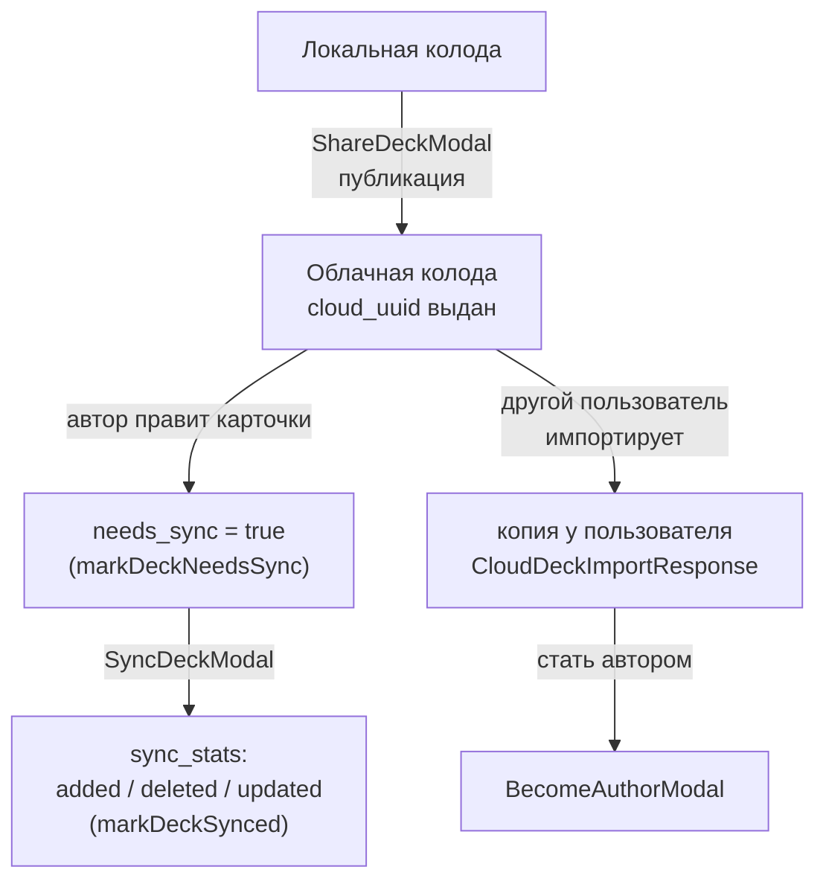

---
tags:
  - flashmind
  - cloud
  - sharing
created: 2026-08-26
up: "[[00 Home]]"
---

# ☁️ 12 — Cloud Decks

> [!abstract] О чём эта заметка
> Облачные колоды: публикация своих колод, каталог чужих, импорт одним нажатием и синхронизация изменений между автором и подписчиками.

## 🧩 Модель `CloudInfo`

Каждая колода несёт блок облачной информации ([`storage/types/types.ts`](../../storage/types/types.ts:6)):

```ts
interface CloudInfo {
  is_approved: boolean;         // прошла ли модерацию
  is_cloud_deck: boolean;       // опубликована ли в облаке
  needs_sync: boolean;          // есть ли несинхронизированные правки
  cloud_deck_id?: string;       // uuid в облаке (у обычных колод отсутствует)
  cloud_type?: "PUBLIC" | "PRIVATE";
  is_author?: boolean;          // пользователь — автор этой облачной колоды
  author_id?: string;
}
```

## 🔁 Жизненный цикл облачной колоды



## 📤 Публикация и шеринг

- Кнопка «поделиться» в [`DeckViewById.tsx`](../../feature/decks/deck-by-id/screens/DeckViewById.tsx) открывает [`ShareDeckModal.tsx`](../../feature/decks/deck-by-id/components/ShareDeckModal.tsx).
- Ответ сервера — `CloudDeckShareResponse`:

```ts
{
  cloud_uuid: string;
  status: string;
  sync_stats: { added: number; deleted: number; updated: number };
  type: string; // PUBLIC | PRIVATE
}
```

- Снятие с публикации — [`ShareDeckDeleteCloudModal.tsx`](../../feature/decks/deck-by-id/components/ShareDeckDeleteCloudModal.tsx).

## 🔄 Синхронизация

- Компонент [`SyncDeckModal.tsx`](../../feature/decks/components/SyncDeckModal.tsx): показывает, сколько карточек будет added/deleted/updated.
- Стор держит флаг актуальности через `markDeckNeedsSync(deckId)` / `markDeckSynced(deckId)` ([[06 Состояние и кэш]]) — точечно меняет `cloud_info.needs_sync`, не трогая остальной кэш.

## 📥 Каталог и импорт

Маршруты внутри `app/decks/cloud-decks/`:

| Маршрут | Экран | Назначение |
| --- | --- | --- |
| `/decks/cloud-decks` | [`CloudDecksScreen.tsx`](../../app/decks/cloud-decks/screens/CloudDecksScreen.tsx) + [`CloudDecksView.tsx`](../../app/decks/cloud-decks/components/CloudDecksView.tsx) | каталог облачных колод |
| `/decks/cloud-decks/[cloudDeckId]` | [`CloudDecksPreview.tsx`](../../app/decks/cloud-decks/[cloudDeckId]/screens/CloudDecksPreview.tsx) | превью колоды перед импортом |
| `/decks/cloud-decks/card/[cloudCardId]` | [`CloudCardView.tsx`](../../app/decks/cloud-decks/card/screens/CloudCardView.tsx) | просмотр карточки без импорта |

Импорт возвращает `CloudDeckImportResponse`:

```ts
{
  added: number;        // сколько карточек добавлено
  deck_id: string;      // созданная/обновлённая локальная колода
  cloud_uuid: string;
  deck_name: string;
  deck_description?: string;
  cards: Card[];
}
```

После импорта колода появляется в общем списке (`/decks`) с признаком облачной; пользователь может стать её автором через `BecomeAuthorModal`.

---

> [!tip] Отладка
> Логи синхронизации ищите по маркерам `[Storage]`, `needs_sync`, `cloud_uuid`. Полный сброс кэша — `clearAllData()` ([[06 Состояние и кэш]]).

> [!summary] Связанные заметки
> [[08 Колоды и карточки]] · [[05 API слой]] · [[06 Состояние и кэш]]
