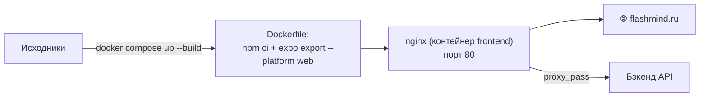

---
tags:
  - flashmind
  - deploy
  - docker
  - safari
created: 2026-08-26
up: "[[00 Home]]"
---

# 🚢 14 — Safari-расширение и деплой

> [!abstract] О чём эта заметка
> Вспомогательные части репозитория: Xcode-проект Safari Web Extension (`FlashMind/`) и деплой веб-версии через Docker + nginx.

## 🧭 Safari Web Extension — `FlashMind/`

Нативный шаблон расширения Safari (создан Xcode), Manifest **V3**:

```
FlashMind/
├── Shared (Extension)/
│   ├── SafariWebExtensionHandler.swift   # нативный обработчик сообщений
│   └── Resources/
│       ├── manifest.json                 # MV3: background service_worker,
│       │                                 # content_scripts, action.popup
│       ├── background.js                 # service worker расширения
│       ├── content.js                    # контент-скрипт (matches: example.com)
│       ├── popup.html / popup.js / popup.css
│       ├── _locales/en/messages.json     # локализация имени/описания
│       └── images/                       # иконки 16–512 px
├── macOS (Extension)/                    # таргет macOS: entitlements, Info.plist
├── iOS (App) + iOS (Extension)/          # таргеты iOS
└── Shared (App)/                         # общее приложение-хост (Main.html)
```

Ключевые факты из [`manifest.json`](../../FlashMind/Shared%20(Extension)/Resources/manifest.json):

- `background.service_worker` → `background.js`
- `content_scripts` → `content.js`, пока матчится только `*://example.com/*` (заготовка)
- `action.default_popup` → `popup.html`
- `permissions: []` — привилегий не запрошено

> [!note] Статус
> Это стартовый шаблон расширения (имя/описание из `_locales`), а не готовая фича. Чтобы связать его с FlashMind, нужно описать реальные хосты в `content_scripts.matches` и логику обмена данными с API.

Сборка: открыть проект в Xcode → выбрать таргет (macOS/iOS) → Run; для публикации — App Store Connect.

## 🐳 Деплой веб-версии

### Пайплайн



### Составляющие

| Файл | Роль |
| --- | --- |
| [`Dockerfile`](../../Dockerfile) | многоступенчатая сборка: установка зависимостей → `npm run web:build` (`expo export`) → копирование статики в образ nginx |
| [`docker-compose.yaml`](../../docker-compose.yaml) | сервис `nginx-frontend` (container_name `frontend`), порт **80:80**, bridge-сеть `app-network` |
| [`nginx.conf`](../../nginx.conf) | раздача SPA: fallback на `index.html`, gzip, проксирование запросов к бэкенду |
| `public/` | статика веб-версии: favicon, favicon-apple, `index.html` |

### Команды

```bash
# Собрать и поднять
docker compose up --build -d

# Проверить
curl -I http://localhost

# Остановить
docker compose down
```

### Конфигурация окружения при сборке

`EXPO_PUBLIC_*` переменные «запекаются» в бандл на этапе экспорта ([[02 Быстрый старт]]). Для прод-сборки передайте их как build-args или задайте в Dockerfile:

```dotenv
EXPO_PUBLIC_AUTH_API_URL=https://flashmind.ru
EXPO_PUBLIC_MAIN_SERVICE_API_URL=https://flashmind.ru
```

## ⚙️ Прочая инфраструктура репозитория

| Элемент | Назначение |
| --- | --- |
| `.github/` | служебные файлы GitHub |
| `.husky/` | git-hooks: pre-commit прогоняет lint-staged (ESLint --fix + Prettier) |
| `declarations.d.ts` | типы для нетипизированных импортов (шрифты, PNG) |
| `babel.config.cjs` | preset expo + `module-resolver` для алиаса `@/*` |
| `metro.config.cjs` | Metro + `react-native-svg-transformer` |

---

> [!summary] Связанные заметки
> [[02 Быстрый старт]] · [[15 Конвенции разработки]]
