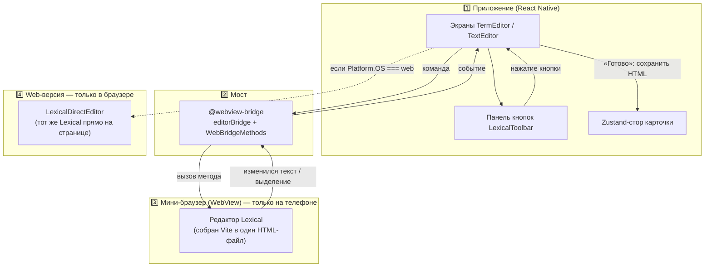

# 📝 Rich-редактор карточек FlashMind (Lexical в React Native)

> [!abstract] О чём этот документ
> Это **полное руководство** по rich-текстовому редактору, которым редактируются блоки **«Термин»** и **«Текст»** карточек. Написано для новичка: объясняется *что*, *где*, *почему* и *как* работает, а в конце — подробные туториалы **как кастомизировать редактор и добавлять новые функции самостоятельно** (включая готовый пример — добавление таблиц).
>
> Основа — архитектура репозитория [seranking-planable/react-native-lexical](https://github.com/seranking-planable/react-native-lexical): Lexical работает внутри WebView, а React Native общается с ним через специальный «мост».
>
> Теги: #editor #lexical #webview #архитектура #туториал

---

## 📑 Оглавление

1. [[#🧠 Глоссарий для новичка|Глоссарий для новичка]]
2. [[#🏗️ Архитектура простыми словами|Архитектура простыми словами]]
3. [[#🗺️ Карта файлов|Карта файлов]]
4. [[#🔄 Жизненный цикл шаг за шагом|Жизненный цикл: шаг за шагом]]
5. [[#🔍 Подробный разбор каждого файла|Подробный разбор каждого файла]]
6. [[#⌨️ Все команды тулбара|Все команды тулбара]]
7. [[#🖥️ Экраны TextEditor и TermEditor|Экраны TextEditor и TermEditor]]
8. [[#📄 Как форматирование попадает на карточку|Как форматирование попадает на карточку]]
9. [[#🔧 Сборка и пересборка|Сборка и пересборка]]
10. [[#📦 Зависимости|Зависимости]]
11. [[#🐛 Отладка и логи|Отладка и логи]]
12. [[#⚠️ Нюансы и грабли|Нюансы и грабли]]
13. [[#🎨 Кастомизация|Кастомизация: меняем всё под себя]]
14. [[#➕ Туториал добавляем новую функцию|Туториал: добавляем новую функцию]]
15. [[#📊 Почему таблицы не вставляются и как это исправить|Почему таблицы не вставляются и как это исправить]]

---

## 🧠 Глоссарий для новичка

Прежде чем разбирать код — 8 терминов, без которых ничего не понять.

| Термин | Что это | Аналогия |
| --- | --- | --- |
| **RN** | Сокращение от **React Native** — фреймворк, на котором написано приложение FlashMind. Позволяет одним кодом на JavaScript/React собирать приложения для iOS, Android и веба. Всё, что «RN-сторона», «RN вызывает» — имеется в виду код самого приложения (экраны, сторы, компоненты) | Один чертёж → три дома |
| **Lexical** | Библиотека rich-редактора от Meta. Работает **только в браузере** (поверх `contenteditable`). Умеет хранить текст со стилями в виде дерева «узлов» | Word внутри браузера |
| **Узел (node)** | Кусочек контента в Lexical: абзац (`ParagraphNode`), заголовок (`HeadingNode`), текст (`TextNode`), элемент списка (`ListItemNode`)… | Кирпичики документа |
| **Команда (`dispatchCommand`)** | Способ сказать редактору «сделай действие»: `dispatchCommand(FORMAT_TEXT_COMMAND, 'bold')` сделает выделение жирным | Пульт управления |
| **Плагин** | React-компонент без интерфейса, который «подключает» к редактору поведение (история, списки, мост…) | Приложение к телефону |
| **WebView** | «Мини-браузер» внутри мобильного приложения. Умеет показывать HTML-страницу | Окно с сайтом внутри приложения |
| **Мост (bridge)** | Канал связи RN ↔ страница в WebView. Библиотека `@webview-bridge`: нативный код вызывает функции страницы, страница — функции нативного кода | Телефонная линия между двумя мирами |
| **EditorState** | Снимок всего содержимого редактора в момент времени. Из него можно получить HTML или JSON | Фотография документа |
| **HTML** | Итоговый формат хранения: `<p>Привет <b>мир</b></p>`. Именно HTML сохраняется в блоке карточки | Файл документа |

> [!question] Почему нельзя просто взять Lexical и использовать в RN?
> Потому что Lexical — это JavaScript, работающий с браузерным DOM (`document`, `contenteditable`). В iOS/Android такого DOM нет. Решение: запустить Lexical **внутри мини-браузера (WebView)** и научить приложение с ним разговаривать. Этим и занимается вся описанная ниже система.

---

## 🏗️ Архитектура простыми словами

Есть **три действующих лица**:



**Главная мысль:** логика команд написана **один раз** (в `lexical/toolbarActions.ts`), а исполняется двумя способами:
- на **телефоне** команда улетает в WebView, где её выполняет Lexical;
- в **браузере** та же команда выполняется локальным экземпляром Lexical.

Поэтому поведение везде одинаковое, а код экранов не знает, где он работает.

### Почему у нас два «экземпляра» редактора?

| | 📱 Натива (iOS/Android) | 💻 Web (браузер) |
| --- | --- | --- |
| Где живёт Lexical | Внутри WebView (отдельная сборка `lexical-editor`, lexical **0.14**) | Прямо в приложении (lexical **0.49**) |
| Компонент | `LexicalWebViewEditor.tsx` | `LexicalDirectEditor.tsx` |
| Связь | `@webview-bridge` (postMessage) | Прямые вызовы функций React |
| Стили темы | Вшиты в сборку (`Editor.css`) | Инжектятся в `<head>` из `EDITOR_THEME_CSS` |

> [!warning] Версии Lexical разные — и это нормально!
> Внутренняя сборка сидит на 0.14 (как в оригинальном репозитории), приложение — на 0.49. Они **не конфликтуют**, потому что живут в разных «мирах». Единственное правило: файл общих типов `shared/types.ts` **не должен импортировать типы из `lexical`**, иначе TypeScript увидит конфликт. Поэтому там объявлены свои union-типы (`EditorTextFormat`, `EditorElementFormat`).

---

## 🗺️ Карта файлов

### 🅰️ Суб-приложение `lexical-editor/` — «начинка» WebView

Собирается отдельно и превращается в одну HTML-строку.

| Файл | Что делает | Когда вы его трогаете |
| --- | --- | --- |
| `src/Editor.tsx` | Корень: создаёт редактор, регистрирует узлы, грузит стартовый HTML, показывает плейсхолдер | Добавляете новые типы узлов (таблицы, цитаты…) |
| `src/plugins/EditorBridgePlugin.tsx` | «Пульт»: принимает команды из приложения, публикует состояние тулбара и изменения текста | Добавляете новую команду/кнопку |
| `src/utils/getSelectedNode.ts` | Определяет, на каком узле стоит курсор | Почти никогда |
| `src/EditorTheme.ts` | Соответствие «формат → CSS-класс» (`bold → editor-text-bold`) | Меняете названия классов |
| `src/Editor.css` | Внешний вид текста внутри поля + подключение Google-шрифтов | Меняете вид текста в поле |
| `vite.config.ts` | Сборка: всё склеивается в один `index.html`, который конвертируется в TS-строку | Почти никогда |
| `package.json` | Зависимости веб-части (lexical 0.14 и др.) | Добавляете плагины Lexical |

### 🅱️ Общие файлы

| Файл | Что делает |
| --- | --- |
| `shared/types.ts` | «Контракт» между мирами: какие параметры принимает редактор, какие команды понимает, какое состояние отдаёт |
| `shared/generated/lexicalHtmlString.ts` | ⚙️ **Автогенерируемый**. Вся HTML-страница редактора одной огромной строкой. Не редактировать руками! |

### 🅲 RN-сторона `feature/decks/deck-create-card/components/`

| Файл | Что делает | Когда трогаете |
| --- | --- | --- |
| `editorBridge.ts` | Хранилище моста: готовность, состояние тулбара, фокус + подписка на изменения текста | Почти никогда |
| `LexicalWebView.tsx` | Создаёт WebView, привязанный к мосту; экспортирует методы вызова команд | Почти никогда |
| `LexicalWebViewEditor.tsx` | Нативный компонент редактора: инжект параметров, подписки, сам WebView | Добавляете новый проп |
| `LexicalDirectEditor.tsx` | Web-компонент редактора: тот же конфиг + инжект CSS темы | Симметрично нативному |
| `LexicalToolbar.tsx` | Панель кнопок (иконки FontAwesome) | Добавляете/меняете кнопки |
| `lexical/toolbarActions.ts` | Диспетчер: «имя действия → конкретная команда Lexical» для обеих платформ | Добавляете новое действие |
| `lexical/EditorTheme.ts`, `lexical/getSelectedNode.ts` | Копии темы/утилиты для web-версии | Симметрично веб-части |
| `editors/TextEditor.tsx` | Экран блока «Текст» | Лимиты, вёрстка экрана |
| `editors/TermEditor.tsx` | Экран блока «Термин» (лимит 40 символов) | То же |
| `HtmlText.tsx` | Показ сохранённого HTML на карточке (react-native-render-html) | Стили отображения |

### 🅳 Где значение показывается пользователю

| Файл | Что рендерит |
| --- | --- |
| `blocks/TermBlock.tsx`, `blocks/TextBlock.tsx` | Блоки на экране сторон (серый текст) |
| `PreviewModal.tsx` | Поп-ап предпросмотра («глазик») — тёмный текст 20px |
| `deck-study-process/components/StudyCardView.tsx` | Карточка в режиме изучения (работало и раньше) |

> [!note]- Легаси (не используется, можно удалить)
> `components/LexicalWebEditor.tsx` и `components/editorTemplate.ts(.js)` — старый редактор на Tiptap. После миграции ниоткуда не импортируются.

---

## 🔄 Жизненный цикл шаг за шагом

Разберём путь от открытия экрана до сохранения — **по шагам, с файлами**.

### Шаг 1. Открытие экрана

`app/decks/[id]/create-card/text-editor.tsx` → рендерит [`TextEditor`](feature/decks/deck-create-card/components/editors/TextEditor.tsx).

Тот достаёт из стора текущее значение блока:

```ts
const block = (sideKey === "front" ? front : back).find((b) => b.id === blockId);
const initialValue = block?.value ?? "";   // ← HTML, сохранённый раньше
```

### Шаг 2. Выбор реализации по платформе

```ts
if (Platform.OS === "web") {
  LexicalDirectEditor = require("../LexicalDirectEditor").LexicalDirectEditor;
} else {
  LexicalWebViewEditor = require("../LexicalWebViewEditor").LexicalWebViewEditor;
}
```

> [!why] Почему `require`, а не `import`?
> `import` загрузил бы **оба** модуля на любой платформе. А `LexicalWebView` тянет за собой WebView и 300-килобайтную строку HTML — на web это лишний вес. Ленивый `require` загружает только нужное.

### Шаг 3. Инициализация редактора

- **Натива**: `LexicalWebViewEditor` перед монтированием страницы инжектит параметры:

```ts
window.editorParams = {
  namespace: "FlashMindLexical_1",   // уникальное имя сессии
  initialHtml: "<p>Привет</p>",      // стартовый контент
  placeholder: "Введите текст...",
  enableOnChangePlugin: { includePlainText: true, includeHtmlText: true, includeJsonState: false },
};
```

Внутри страницы `Editor.tsx` читает их и: парсит `initialHtml` в узлы (`$generateNodesFromDOM`), ставит плейсхолдер, включает плагин изменений.

- **Web**: `LexicalDirectEditor` делает то же самое, но через props и обычный `DOMParser` — без WebView.

### Шаг 4. Пользователь печатает

Lexical меняет своё внутреннее дерево → плагин изменений публикует наружу:

- **натива**: `changeNotification({ plainText, htmlText })` → мост → `subscribeToEditorChanges` в `LexicalWebViewEditor` → `onChange(html, length)` → `setLocalHtml/setTextLength` на экране;
- **web**: `registerUpdateListener` в `DirectBridgePlugin` → те же колбэки напрямую.

> [!important] Почему текст хранится в локальном состоянии, а не сразу в стор?
> Zustand-стор перерендерил бы полприложения на каждый символ. Поэтому экран держит `localHtml` и пишет в стор только по кнопке «Готово».

### Шаг 5. Нажатие кнопки тулбара (например, **B**)

```
LexicalToolbar: onAction("bold")
   ↓
TextEditor.handleToolbarAction("bold")
   ↓ (ветка по платформе)
натива: sendToolbarActionToWebView("bold")
          └─ LexicalWebMethods.current.formatTextCommand("bold")   ← вызов ВНУТРИ WebView
               └─ EditorBridgePlugin: editor.dispatchCommand(FORMAT_TEXT_COMMAND, "bold")
web:    applyToolbarActionLocally(editorRef.current, "bold")
          └─ editor.dispatchCommand(FORMAT_TEXT_COMMAND, "bold")   ← локально
```

После применения Lexical снова публикует изменение → шаг 4 → поле и счётчик обновляются.

### Шаг 6. Движение курсора → подсветка кнопок

При каждом изменении выделения плагин собирает снимок состояния:

```ts
{ canUndo, canRedo, isBold, isItalic, isUnderline,
  isStrikethrough, isCode, headingLevel, listType, elementFormat }
```

и отправляет приложению. `LexicalToolbar` получает его через проп `state` и подсвечивает активные кнопки (подложка `colors.lightMainColor`).

> [!bug]- История: почему ломались стрелки undo/redo
> На web флаги `canUndo/canRedo` изначально брались из дефолтного состояния при **каждом** обновлении — и затирались в `false`. Стрелки были вечно `disabled`. Фикс: флаги хранятся в `historyFlagsRef` и подмешиваются в каждое исходящее состояние; сброс на blur убран.

### Шаг 7. «Готово» → сохранение

```ts
updateDraftBlockValue(sideKey, blockId, localHtml.trim());
router.push({ pathname: `/decks/${id}/create-card/side-editor`, params: { side } });
```

HTML попадает в блок карточки (Zustand) → дальше его видят `TermBlock` / `TextBlock` / `PreviewModal` / экран изучения — все рендерят его через `HtmlText`.

---

## 🔍 Подробный разбор каждого файла

### `lexical-editor/src/Editor.tsx` — корень веб-части

```tsx
const initialConfig = {
  namespace: window.editorParams.namespace ?? 'MyLexicalEditor',
  theme: EditorTheme,                 // классы форматов (см. ниже)
  onError(error) { console.error(error); },
  nodes: [HeadingNode, QuoteNode, ListNode, ListItemNode],
  // ↑ РЕГИСТРАЦИЯ УЗЛОВ. Без этого Lexical не знает, что такое h1/list,
  //   и команды заголовков/списков упадут с ошибкой.
  ...(window.editorParams.initialEditorState
      ? { editorState: window.editorParams.initialEditorState } // JSON (режим оригинального репо)
      : window.editorParams.initialHtml
        ? { editorState: loadInitialHtml }                      // ← наш режим: старт из HTML
        : {}),
};
```

Функция `loadInitialHtml`:

```ts
function loadInitialHtml(editor: LexicalEditor) {
  const dom = new DOMParser().parseFromString(window.editorParams.initialHtml ?? '', 'text/html');
  const nodes = $generateNodesFromDOM(editor, dom); // HTML → дерево узлов Lexical
  $getRoot().clear();
  if (nodes.length > 0) $getRoot().append(...nodes);
}
```

Также здесь подключены `HistoryPlugin` (undo/redo), `ListPlugin` и плейсхолдер из `window.editorParams.placeholder`.

### `lexical-editor/src/plugins/EditorBridgePlugin.tsx` — пульт и датчики

Три обязанности:

**① Команды (RN вызывает их):**

```ts
const webBridge: WebBridge = {
  formatTextCommand(payload) {           // 'bold' | 'italic' | 'underline' | 'strikethrough'
    editor.dispatchCommand(FORMAT_TEXT_COMMAND, payload);
    return Promise.resolve();
  },
  setHeadingCommand(level) {             // 'h1'|'h2'|'h3'|'paragraph'
    editor.update(() => {
      const selection = $getSelection();
      if (!$isRangeSelection(selection)) return;
      if (level === 'paragraph') { $setBlocksType(selection, () => $createParagraphNode()); return; }
      const heading = /* ищем HeadingNode под курсором */;
      if ($isHeadingNode(heading) && heading.getTag() === level) {
        $setBlocksType(selection, () => $createParagraphNode()); // повторный клик = снять
      } else {
        $setBlocksType(selection, () => $createHeadingNode(level));
      }
    });
    return Promise.resolve();
  },
  toggleBulletListCommand() { toggleList('bullet'); … },   // INSERT_UNORDERED_LIST / REMOVE_LIST
  setColorCommand(color) { /* $patchStyleText(selection, { color }) */ },
  getEditorHtml() { /* $generateHtmlFromNodes → строка */ },
  // … undo/redo/formatElement/toggleCode/getJson/setJson
};
registerWebMethod(webBridge);   // ← делает методы видимыми для RN
```

**② Состояние тулбара.** На каждое изменение выделения (`SELECTION_CHANGE`, апдейты) функция `updateToolbar()` читает:

```ts
selection.hasFormat('bold')            → isBold
getSelectedNode(selection)             → узел под курсором
$findMatchingParent(node, isHeading)   → headingLevel ('h1'|'h2'|'h3'|null)
$findMatchingParent(node, isListNode)  → listType ('bullet'|'number'|null)
блочный родитель.getFormatType()       → elementFormat
```

и отправляет пакетом: `bridge.setToolbarState({...})`.

**③ Изменения контента.** `OnChangePlugin` → `bridge.changeNotification({ plainText, htmlText })`.

### `shared/types.ts` — контракт миров

> [!example] Почему `formatTextCommand` принимает `'strikethrough'`, а не тип из lexical?
> Потому что файл видят **обе** стороны с разными версиями lexical. Свой union-тип гарантирует совместимость:

```ts
export type EditorTextFormat = 'bold' | 'italic' | 'underline' | 'strikethrough' | 'code';
export type EditorElementFormat = 'left' | 'center' | 'right' | 'justify';
```

Полный состав контракта:

```ts
EditorParams     // что приложение говорит редактору при старте
ToolbarState     // что редактор сообщает о курсоре (для подсветки кнопок)
OnChangePayload  // { plainText?, htmlText?, jsonState? }
WebBridge        // список методов «RN → WebView»
EditorBridgeState// список методов/полей «WebView → RN»
```

### `components/editorBridge.ts` — хранилище моста

```ts
export const editorBridge = bridge<EditorBridgeState>(({ set }) => ({
  isReady: false,                       // WebView загрузился и зарегистрировал методы
  toolbarState: INITIAL_TOOLBAR_STATE,  // последний снимок курсора
  hasFocus: false,
  async changeNotification(payload) {
    changeListeners.forEach((l) => l(payload));   // рассылка подписчикам
  },
}));
```

`subscribeToEditorChanges(listener)` — простой способ подписаться на изменения текста без хуков (используется в `LexicalWebViewEditor`).

### `components/LexicalWebView.tsx` — фабрика WebView

```ts
export const { WebView: LexicalBridgeWebView, linkWebMethod } = createWebView({
  bridge: editorBridge,
  debug: __DEV__,   // в dev console.log из WebView виден в нативном логе
});
export const LexicalWebMethods = linkWebMethod<WebBridge>();
```

- `LexicalBridgeWebView` — используйте **его**, а не голый `react-native-webview`, иначе мост не заработает.
- `LexicalWebMethods.current.isReady` — можно ли слать команды; `.метод()` — вызов внутри страницы.

> [!danger] Этот файл — только для нативы!
> Он импортирует автогенерируемую страницу (~300 КБ) и WebView. На web его подгружают лениво через `require` внутри платформенной ветки.

### `components/LexicalWebViewEditor.tsx` — нативный компонент

Ключевые куски:

```ts
// 1. Параметры страницы (инжектятся ДО выполнения скриптов страницы)
const editorParams: EditorParams = { namespace, initialHtml, placeholder, enableOnChangePlugin: {...} };
const injectedJavaScriptBeforeContentLoaded =
  `(function(){ window.editorParams = ${JSON.stringify(editorParams)}; })();`;

// 2. Контент: changeNotification → onChange(html, length)
useEffect(() => subscribeToEditorChanges((payload) => {
  if (typeof payload.htmlText === 'string')
    onChangeRef.current(payload.htmlText, (payload.plainText ?? '').length);
}), []);

// 3. Курсор: toolbarState из моста → наверх (подсветка кнопок)
const { toolbarState, hasFocus } = useBridge(editorBridge);
useEffect(() => { onSelectionStateRef.current?.(toolbarState); }, [toolbarState]);
```

### `components/LexicalDirectEditor.tsx` — web-компонент

Делает то же, что связка «WebView + плагин», но локально:

- конфиг копирует `Editor.tsx` (те же узлы/тема/старт из HTML);
- `DirectBridgePlugin` вместо моста вызывает колбэки `onChange` / `onSelectionState`;
- **`historyFlagsRef`** — важный паттерн:

```ts
const historyFlagsRef = useRef({ canUndo: false, canRedo: false });
const emitState = () =>
  onSelectionState?.({ ...readToolbarState(editor), ...historyFlagsRef.current });
```

> [!warning] Не убирайте `historyFlagsRef`!
> `readToolbarState()` собирает состояние с нулевыми `canUndo/canRedo`. Если не подмешивать флаги, стрелки undo/redo будут вечно задизейблены, а клик по ним будет отменяться перерендером.

- `ThemeStyleInjection` вставляет в `<head>` константу `EDITOR_THEME_CSS` — **копию стилей темы**. Без неё жирный/курсив применяются «в модели», но визуально текст не меняется (классам `editor-text-bold` неоткуда взяться). Селекторы ограничены `#lexical-direct-editor-root`, чтобы стили не утекали на весь сайт.

### `components/LexicalToolbar.tsx` — панель

Чистый компонент: `props = { state: ToolbarState, onAction(action, payload?) }`.
Кнопка активна, если соответствующее поле `state` истинно; подложка активной — `colors.lightMainColor`.
Undo/Redo дополнительно гейтятся: `{...(state.canUndo ? { onPress } : { disabled: true })}`.

### `components/lexical/toolbarActions.ts` — диспетчер

Две функции с одинаковой таблицей действий:

| Функция | Где выполняется | Как |
| --- | --- | --- |
| `applyToolbarActionLocally(editor, action, payload)` | web | `editor.dispatchCommand(...)` напрямую |
| `sendToolbarActionToWebView(action, payload)` | натива | ленивый `require('../LexicalWebView')` → `LexicalWebMethods.current.метод()` |

Полная таблица соответствий — в разделе [[#⌨️ Все команды тулбара]].

---

## ⌨️ Все команды тулбара

| Ключ `action` | Что делает | Lexical-механика | Состояние для подсветки |
| --- | --- | --- | --- |
| `undo` / `redo` | Отмена/повтор | `UNDO_COMMAND` / `REDO_COMMAND` (плагин HistoryPlugin) | `canUndo` / `canRedo` |
| `bold` | Жирный | `FORMAT_TEXT_COMMAND 'bold'` | `isBold` |
| `italic` | Курсив | `… 'italic'` | `isItalic` |
| `underline` | Подчёркнутый | `… 'underline'` | `isUnderline` |
| `strikeThrough` | Зачёркнутый | `… 'strikethrough'` | `isStrikethrough` |
| `H1` / `H2` / `H3` | Заголовок | `$setBlocksType($createHeadingNode('h1'))`; повторно → параграф | `headingLevel` |
| `main` | Обычный текст | `$setBlocksType($createParagraphNode())` | `headingLevel === null && !isCode` |
| `bulletList` | Маркированный список | `INSERT_UNORDERED_LIST_COMMAND` / `REMOVE_LIST_COMMAND` (toggle) | `listType === 'bullet'` |
| `numberedList` | Нумерованный список | `INSERT_ORDERED_LIST_COMMAND` / `REMOVE_LIST_COMMAND` | `listType === 'number'` |
| `mono` / `code` | Инлайн-код | `FORMAT_TEXT_COMMAND 'code'` | `isCode` |
| `alignLeft` / `alignCenter` / `alignRight` / `alignJustify` | Выравнивание блока | `FORMAT_ELEMENT_COMMAND` | `elementFormat` |
| `SET_COLOR` (+ hex в payload) | Цвет выделенного текста | `$patchStyleText(sel, { color })` | — (цвет кружка хранится локально) |
| `pencil` | Ничего (визуальный переключатель кисти) | — | — |

---

## 🖥️ Экраны TextEditor и TermEditor

Общая структура (одинаковая у обоих):

```
View (flex:1, фон)
└─ commonStyles.container
   ├─ ScrollView (paddingHorizontal:10, paddingTop:20, paddingBottom:30)
   │  ├─ Шапка: «назад» + заголовок («Текст» / «Термин»)
   │  ├─ LexicalToolbar                ← панель НАД полем
   │  └─ workArea
   │     ├─ editorBox (372×520)        ← размер карточки из PreviewModal
   │     │  └─ LexicalDirectEditor | LexicalWebViewEditor
   │     └─ счётчик символов
   └─ MainButton «Готово»
```

| Параметр | TextEditor | TermEditor |
| --- | --- | --- |
| Лимит | 500 (только счётчик) | **40**: счётчик краснеет (`colors.red1`), кнопка полупрозрачная «Максимум 40 символов», сохранение заблокировано |
| Плейсхолдер | «Введите текст...» | «Введите термин» |
| Размер поля | 372×520 | 372×520 |

> [!note] Почему высота поля фиксированная (520)?
> Если дать полю расти (`minHeight` + `flexGrow`), то при открытии клавиатуры окно ресайзится, контент переразмечается — страница «прыгает». Фиксированная высота = стабильная раскладка; длинный текст скроллится внутри самого поля.

Сохранение:

```ts
const handleSave = () => {
  updateDraftBlockValue(sideKey, blockId, localHtml.trim()); // HTML → стор
  router.push({ pathname: `/decks/${id}/create-card/side-editor`, params: { side } });
};
```

---

## 📄 Как форматирование попадает на карточку

Значение блока — это **HTML-строка** (например `<p><strong>Каталог</strong></p><ul><li>…`).

Компонент [`HtmlText.tsx`](feature/decks/deck-create-card/components/HtmlText.tsx) рисует её через `react-native-render-html`:

```tsx
<RenderHtml contentWidth={width} source={{ html }}
  baseStyle={{ fontFamily: "MontserratMedium", fontSize, color }}
  tagsStyles={{ h1: {...}, ul: {...}, code: {...}, a: {...} }} />
```

Используется в:
- `TermBlock.tsx` / `TextBlock.tsx` — серым `darkGray` (как было исторически);
- `PreviewModal.tsx` — тёмным `#1E1F4B`, размер 20;
- изучении карточек — `StudyCardView.tsx` (RenderHtml использовался там и раньше).

> [!tip] Добавили новый тег в редакторе?
> Не забудьте стиль для него в `tagsStyles` (HtmlText) — иначе на карточке он будет выглядеть «по умолчанию».

---

## 🔧 Сборка и пересборка

> [!example] Правили что-то в `lexical-editor/src/**`? Обязательно пересоберите!
> ```bash
> cd lexical-editor
> npm install     # только первый раз
> npm run build   # tsc && vite build → перезапишет shared/generated/lexicalHtmlString.ts
> ```
> Затем перезапустите Metro (`npx expo start -c`).

- `npm run dev` внутри `lexical-editor` — открыть веб-часть в обычном браузере для отладки (мост недоступен, но редактор живой).
- Корневой `tsconfig.json` исключает папку `lexical-editor` — у неё свой компилятор и зависимости.

---

## 📦 Зависимости

Корневой `package.json` (добавлено):

| Пакет | Зачем |
| --- | --- |
| `@webview-bridge/react-native@^1.4.0` | Мост RN ↔ WebView |
| `@fortawesome/*` + `react-native-fontawesome` | Иконки тулбара (поверх установленного `react-native-svg`) |
| `@lexical/list`, `@lexical/rich-text`, `@lexical/selection`, `@lexical/utils` | Узлы/хелперы (явные импорты) |

`lexical-editor/package.json`: `lexical@^0.14.2`, `@lexical/*@^0.14.2`, `@webview-bridge/web`, `vite`, `vite-plugin-singlefile`.

Прочее: `app.json` → `"softwareKeyboardLayoutMode": "resize"` (Android); `tsconfig.json` → exclude `lexical-editor`.

---

## 🐛 Отладка и логи

| Где смотрим | Что появится |
| --- | --- |
| Консоль браузера (web) | `[toolbarActions] web action → bold` |
| Нативный лог (Metro) | `[toolbarActions] native action → bold \| bridge ready: true` |
| Нативный лог (dev) | `[LexicalWebView] command: formatText bold` — проброс консоли WebView (`debug: __DEV__`) |

Чек-лист «кнопка не работает»:
1. `bridge ready: false` → WebView ещё не готов; проверьте, что рендерится `LexicalBridgeWebView`.
2. Команда приходит, но текст не меняется → нет выделения/курсора.
3. Текст меняется в модели, но выглядит так же (web) → не заинжектился CSS темы.
4. Инспекция WebView (Chrome DevTools → `chrome://inspect`): `window.editorParams`, ошибки консоли.

---

## ⚠️ Нюансы и грабли

1. **Две версии lexical** — не импортируйте типы `lexical` в `shared/types.ts`.
2. **CSS темы обязателен на web** (`EDITOR_THEME_CSS`).
3. **`canUndo/canRedo`** — только через ref-паттерн, не из дефолтов.
4. **Высота поля фиксированная** — иначе прыжки при клавиатуре.
5. **`LexicalWebView.tsx`** — не импортировать на web статически.
6. **`mono`/`code`** — это *инлайн*-код, не код-блок.
7. **Цвет текста** хранится как inline-style и экспортируется в HTML (`style="color: …"`).
8. **Пересборка после правок веб-части обязательна** — иначе изменения «не применяются».

---

## 🎨 Кастомизация

### Поменять размер поля ввода

`editors/TextEditor.tsx` (и `TermEditor.tsx`) → `styles.editorBox`:

```ts
editorBox: {
  width: 372,          // ширина (сейчас = карточке превью)
  height: 520,         // высота (фиксированная!)
  borderRadius: 20,
  ...
}
```

### Поменять цвет/вид панели

`components/LexicalToolbar.tsx` → `styles.touchableBgActive.backgroundColor` (сейчас `colors.lightMainColor`), отступы, иконки (`faBold` → любая из `free-solid-svg-icons`).

### Поменять шрифт/размер текста в поле

- **Внутри WebView**: `lexical-editor/src/Editor.css` → `.editor-input { font-size, font-family }`.
- **На web**: `LexicalDirectEditor.tsx` → inline-стиль `ContentEditable`.
- **На карточке**: `HtmlText.tsx` → `baseStyle` / `fontSize`.

### Поменять плейсхолдер

Передать проп `placeholder="..."` в `LexicalDirectEditor` / `LexicalWebViewEditor` (TermEditor уже передаёт «Введите термин»). Значение летит в WebView через `EditorParams.placeholder`.

### Поменять лимит символов термина

`editors/TermEditor.tsx` → `const MAX_TERM_LENGTH = 40;`

### Изменить, как выглядит формат на карточке

`HtmlText.tsx` → `tagsStyles` (например, `h1: { fontSize: 26 }`).

---

## ➕ Туториал: добавляем новую функцию

Универсальный алгоритм — **6 касаний**:

```
1. lexical-editor/src/plugins/EditorBridgePlugin.tsx  → новая команда (webBridge.XXX)
2. shared/types.ts                                    → метод в WebBridge (+поле ToolbarState, если нужно)
3. components/lexical/toolbarActions.ts               → case в ОБЕИХ функции-диспетчера
4. components/LexicalToolbar.tsx                      → сама кнопка
5. cd lexical-editor && npm run build                 → пересборка
6. HtmlText.tsx (+ Editor.css / EDITOR_THEME_CSS)     → стиль отображения на карточке
```

> [!example]- Пример целиком: кнопка «Цитата» (blockquote)
> **1. Команда** — `EditorBridgePlugin.tsx`, внутрь `webBridge`:
> ```ts
> toggleQuoteCommand(): Promise<void> {
>   editor.update(() => {
>     const selection = $getSelection();
>     if (!$isRangeSelection(selection)) return;
>     const node = getSelectedNode(selection);
>     const quote = $findMatchingParent(node, (p) => $isQuoteNode(p));
>     if ($isQuoteNode(quote)) {
>       $setBlocksType(selection, () => $createParagraphNode());   // снять
>     } else {
>       $setBlocksType(selection, () => $createQuoteNode());       // поставить
>     }
>   });
>   return Promise.resolve();
> },
> ```
> Импорты: `import { $createQuoteNode, $isQuoteNode } from '@lexical/rich-text';`
>
> **2. Типы** — `shared/types.ts`, в `WebBridge`:
> ```ts
> toggleQuoteCommand(): Promise<void>;
> ```
>
> **3. Диспетчер** — `toolbarActions.ts`:
> ```ts
> // applyToolbarActionLocally:
> case 'quote': {
>   editor.update(() => { /* тот же код, что выше */ });
>   break;
> }
> // sendToolbarActionToWebView:
> case 'quote': return methods.toggleQuoteCommand();
> ```
>
> **4. Кнопка** — `LexicalToolbar.tsx`:
> ```tsx
> import { faQuoteLeft } from '@fortawesome/free-solid-svg-icons';
> <TouchableOpacity onPress={() => onAction('quote')}>
>   <View style={styles.touchableBg}>
>     <FontAwesomeIcon icon={faQuoteLeft} size={16} />
>   </View>
> </TouchableOpacity>
> ```
>
> **5. Пересборка**: `cd lexical-editor && npm run build`.
>
> **6. Отображение**: `Editor.css` + `EDITOR_THEME_CSS` → `.editor-quote { border-left: 4px solid #ddd; padding-left: 12px; }`; `HtmlText.tsx` → `tagsStyles.blockquote = { borderLeftWidth: 4, ... }`.

---

## 📊 Почему таблицы не вставляются и как это исправить

> [!bug] Текущее состояние
> Таблиц в редакторе **нет вообще**: не зарегистрированы табличные узлы (`TableNode`/`TableRowNode`/`TableCellNode`), не подключён `TablePlugin`, нет кнопки. Поэтому при попытке вставить таблицу из буфера Lexical просто отбрасывает неизвестный контент — «ничего не происходит». Это не баг сборки, а отсутствие фичи. Ниже — полный туториал, как её добавить самостоятельно (код приведён целиком, останется скопировать).

### Шаг 0. Понимание

За таблицы в Lexical отвечает пакет `@lexical/table` (узлы + плагин + команда `INSERT_TABLE_COMMAND`). Нужно научить **обе** версии редактора (WebView и web) работать с ними, добавить команду моста и кнопку, а также стили — в поле и на карточке.

### Шаг 1. Зависимости

```bash
# корень приложения
npm i @lexical/table@^0.49.0
```

`lexical-editor/package.json` → в `"dependencies"` добавить:
```json
"@lexical/table": "^0.14.2"
```

### Шаг 2. Регистрация узлов + плагин (WebView)

`lexical-editor/src/Editor.tsx`:

```diff
+ import { TablePlugin } from '@lexical/react/LexicalTablePlugin';
+ import { TableNode, TableRowNode, TableCellNode } from '@lexical/table';

  nodes: [
    HeadingNode, QuoteNode, ListNode, ListItemNode,
+   TableNode, TableRowNode, TableCellNode,
  ],
```

и рядом с `<ListPlugin />`:
```diff
+ <TablePlugin />
```

### Шаг 3. Команда моста

`shared/types.ts` → в `WebBridge`:
```ts
/** Вставить пустую таблицу rows×columns в позицию курсора */
insertTableCommand(rows: number, columns: number): Promise<void>;
```

`lexical-editor/src/plugins/EditorBridgePlugin.tsx`:
```diff
+ import { INSERT_TABLE_COMMAND } from '@lexical/table';

  const webBridge: WebBridge = {
+   insertTableCommand(rows: number, columns: number): Promise<void> {
+     console.log('[LexicalWebView] command: insertTable', rows, columns);
+     editor.dispatchCommand(INSERT_TABLE_COMMAND, { rows, columns, includeHeaders: false });
+     return Promise.resolve();
+   },
    undoCommand() { … },
```

### Шаг 4. Стили таблиц в поле

`lexical-editor/src/Editor.css`:
```css
table.editor-table {
  border-collapse: collapse;
  width: 100%;
  margin: 8px 0;
  table-layout: fixed;
}
table.editor-table td,
table.editor-table th {
  border: 1px solid #ddd;
  padding: 6px 8px;
  vertical-align: top;
  min-width: 60px;
}
```

### Шаг 5. Web-версия

`package.json` корня — уже сделано в шаге 1 (`@lexical/table@^0.49.0`).

`components/LexicalDirectEditor.tsx`:
```diff
+ import { TablePlugin } from '@lexical/react/LexicalTablePlugin';
+ import { TableNode, TableRowNode, TableCellNode } from '@lexical/table';

  nodes: [HeadingNode, QuoteNode, ListNode, ListItemNode,
+         TableNode, TableRowNode, TableCellNode],
```
и `<TablePlugin />` рядом с `<ListPlugin />`.

В константу `EDITOR_THEME_CSS` добавить те же правила таблиц из шага 4.

### Шаг 6. Диспетчер

`components/lexical/toolbarActions.ts`:
```diff
+ import { INSERT_TABLE_COMMAND } from '@lexical/table';

  // applyToolbarActionLocally:
+ case 'insertTable':
+   editor.dispatchCommand(INSERT_TABLE_COMMAND, { rows: 2, columns: 2, includeHeaders: false });
+   break;

  // sendToolbarActionToWebView:
+ case 'insertTable':
+   return methods.insertTableCommand(2, 2);
```

### Шаг 7. Кнопка

`components/LexicalToolbar.tsx`:
```diff
+ import { faTable } from '@fortawesome/free-solid-svg-icons';

  {/* после кнопки кода */}
+ <TouchableOpacity onPress={() => onAction('insertTable')}>
+   <View style={styles.touchableBg}>
+     <FontAwesomeIcon icon={faTable} size={16} />
+   </View>
+ </TouchableOpacity>
```

### Шаг 8. Отображение на карточке

`components/HtmlText.tsx` → в `tagsStyles`:
```ts
table: { marginVertical: 6, alignSelf: 'stretch' },
td:    { borderWidth: 1, borderColor: '#DBDBDB', padding: 6, fontSize: fontSize - 1 },
th:    { borderWidth: 1, borderColor: '#DBDBDB', padding: 6, fontWeight: '700', backgroundColor: '#F4F4F9' },
```

### Шаг 9. Пересборка и проверка

```bash
cd lexical-editor && npm install && npm run build && cd ..
npx expo start -c
```

Проверить: кнопка 📊 вставляет сетку 2×2; вставка таблицы из буфера (Ctrl+V) теперь тоже работает — узлы зарегистрированы, и Lexical умеет конвертировать вставляемый HTML; на карточке таблица отображается с рамками.

> [!tip] Расширение
> Захотите выбор размера (сетка 5×5 как в Notion) — замените в кнопке `onAction('insertTable')` на открытие маленького попапа, который вызовет `onAction('insertTable', { rows, cols })`, а в диспетчере читайте размеры из `payload`.

---

## ❓ FAQ

**Q: Где хранится текст карточки?**
A: В Zustand-сторе карточки (`store/card.store.ts`) как HTML-строка в `block.value`. Никакого отдельного формата Lexical в базе нет.

**Q: Можно ли открывать один и тот же блок дважды?**
A: Каждый монтаж редактора создаёт новый `namespace` и работает с копией значения; синхронизации двух открытых редакторов нет.

**Q: Почему на web и телефоне текст может выглядеть чуть по-разному?**
A: Разные сборки lexical (0.14 vs 0.49) и разные механизмы стилей (CSS-файл vs инжект строки). Критичные правки вносите симметрично: `Editor.css` ↔ `EDITOR_THEME_CSS`.

**Q: Как сбросить всё к заводскому виду редактора?**
A: Вернуть файлы из коммита до интеграции: `CustomRichToolbar.tsx` остался нетронутым, старые `LexicalWebEditor.tsx`/`editorTemplate.ts` лежат на месте.
